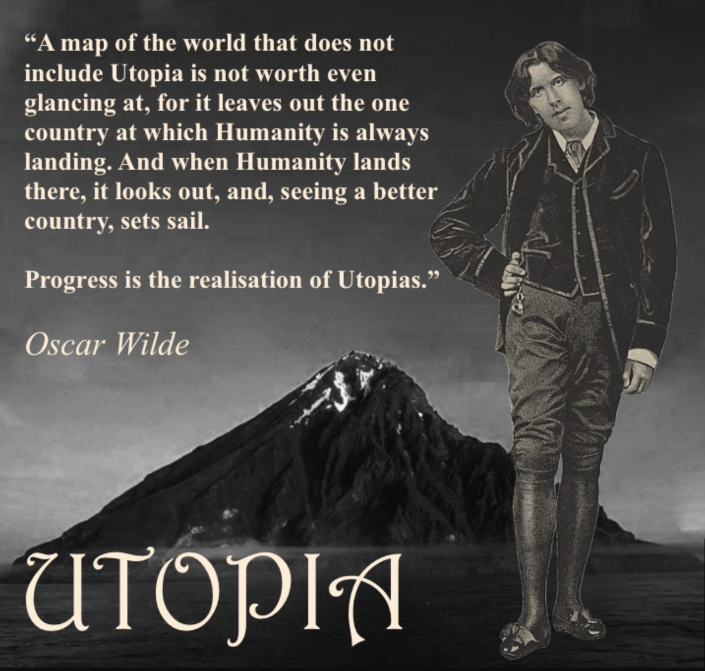

## A better future

[The launch sequences](https://ifp.org/preparing-for-launch/) seem to be really interesting series of papers about AI, but the IFP website has other papers too which are interesting to read!

It has to be the case that non-proliferation of AI technology must be a piece of the solution, as we can compare directly to another technology i.e. nuclear weapons. We collectively made the call that nobody should develop such things. This means routine scanning for AI developments or building of new data centers must take place, and it must be done by an agency like the UN, which does something similar for nuclear weapons, to ensure nobody is able to covertly pursue this.

One of the things stated in the paper is leveraging the fact that AI's improvements are jagged. 

*The future is already here — it's just not very evenly distributed.*

The first step is to predict which are the domains where AI could succeed quickly. Of course, we know by experience, that these are domains which are easily verifiable, such as coding or mathematics. Yet at the same time, it isn't that clear cut. AI has also succeeded in subjective tasks like creating beautiful movies and well-written content. So... it isn't *just* about verification. It's also about the ease of tokenization and deployment. 

## The costs of pausing

This is exactly what I need to read right now. I was an originally AI pilled researcher, who recently became scared of it, and now am uncertain what the right thing to do is. It seems logical for me to stop. If the imminent risks from AI, as per people like Geoffrey Hinton and Yoshua Bengio, is actual extinction, and people in the industry are actually talk about p(doom), stopping makes the most sense to me. Now, let's hear the case for why this may be a costly decision.

Well, this is the exact reason why I was AI pilled in the first place. Yes, the potential benefits are real. 

And that is just in the vaccines side of things, not even medicine as a broad category, and forget about the world as a whole, which is much bigger than just the field of medicine. I personally have around 20% skepticism that all of this would actually happen, which people seem to wholeheartedly accept. It is definitely looking more and more likely given how frontier AI models have been able to find code vulnerabilities and previously unsolved math hypotheses, but... It's tough to compare the risk of existence vs the risks of not getting the proposed benefits.

Is there another option? Not scaling all the way to superintelligence. People seem to think in terms of binary here too. What if we only create AIs that help in those narrow sectors and then stop? Why do we **need** superintelligence itself? I mean, isn't there a balance to be struck here?

Safe to say, the rest of the launch sequence needs to be studied carefully too, but for now, I will continue with the course.

## Utopia for realists

OMG how much resources and reading out there. Instead of marvelling, I need to be hyper aggressive and read them all. It is easy to forget or not even know about how life sucked for most people just decades ago. If you can ask your grandfather or grandmother about disease, death, suffering, sickness that they saw, or perhaps they could enlighten you about what **their** dads and moms went through, this would be clear as day. I ahve the advantage of being born a Nepali, an international student from a third world country, so I got to see some aspects of it, priviledged as I was, I definitely was never blind to it. So this point is clear as day to me. **The lives we lead right now would be how emperors and queens of the past would live,* and this is no overstatement*.** Take something as simple as **access to ice**. In one of his many interesting videos, the MMA coach Firas Zahabi mentioned how for most of human history, having immediate access to ice was not something that was accessible to most humans. Plausibly only people with power, influence, and money, think kings and queens, could request and get that on demand. Yet here we are, in the 21st century, where if I want ice in my water, I can get it from my fridge. We take like this for granted, laughably so, but if we sit and ponder, our life is **filled with luxury**.

A very interesting thing, fromt he years 1300 to 1800, there was a lot of civilizational level inventions, but the average GDP of dountries remained static, for the most part, yet, we know from data that, compared to those days to now, even the countries that are struggling the most are doing much better than the most affluent nations back then. So... what changed?

Somewhere around 1800, the invention of the telephone, cars, the lightbulb, the first dishwasher, these were high leverage inventions, and then the world exploded. It is unrecognizable now, and we've been carrying on with that momentum ever since. Internet connections numbers, people with phones, they far exceeded even the number of people with toilets, although those numbers have probably gone up too from 2014 to 2026. The growth is clear and in a direction pointing towards utopia, really. We are closer than ever.

How about disease, vaccines, and smarts? No more illiteracy! The world is becoming more peaceful, less crime, it is quite incredible to look at history and compare with the present! 

Progress is the realization of utopias, wrote Oscar Wilde, and he would recommend that, once we reach utopia — as it seems we have - we have to rehoist our sails for where to go from here. And onwards we must go. Where is the question, but that is where our work lies. Where indeed, but we must carry on further.

The kind of utopias we imagine tell us about the kind of times we live in. In our history, we once imagined a disease-free future, which we nearly have now, but they reveal what bothered us before. And, indeed, polio, TB, AIDs, measles, chickenpox, smallpox, these were the death of us back in the day, now present no more thanks to vaccines and modern medicine. So... what is our problem now? What kind of utopias can we create? I have some ideas, which I will share below, but first, more content.

> Page 23 typo! "You're not" repeated

And now the authors are beginning to point to the problems that are inherent in our "more civilized" society. Problems of philosophy. Of meaning. Of emptiness. This is precisely what I was about to mention (and I will), but I am happy the authors converged on what i was about to say. Problems of narcissim, too much self-esteem, too little tough love. We are raising pampered princesses, across the board. 
Narcissism up, but also fear/anxiety up. At a glance, paradoxical, but to the observer of the human mind, the human condition, perfectly understandable. Depression. 

> A bitter pill to swallow: we are becoming more and more alike. We consume the same content, think the same thoughts, go through the same experiences, have the same opinions. Diversity of thought = 0. It is capitalism that opened the gates to the Land of Plenty, but capitalism alone cannot sustain it.

Dissatisfaction is an amazing thing because:

a) it is not indifference
b) it points to how we can sketch out our visions for the next utopia

- The perfect is the enemy of the good, Voltaire

## Solarpunk: A Vision for a Sustainable Future

Technology united with nature. An impossible task or some reality to it? I fall into the latter category. We understand more about nature now than every before. In a way, science is an attempt to conquer nature, to understand what makes her tick, how to reverse engineer her. The whole disciplines of physics, math, chemistry, biology is a human attempt to categorize nature, and we have succeed in many things. 100% success in some things, while others are still struggling, but the persuit remains the same. 

It is important to read the works of Solarpunk; it is a literary genre, something that is rooted in hope, as compared to the dystopian cyberpunk. This is exactly in line with the earlier discussion about utopias. 

## Further Reading

- https://www.whitehouse.gov/wp-content/uploads/2025/07/Americas-AI-Action-Plan.pdf
- [Nick Bostrom](https://nickbostrom.com/papers/vulnerable.pdf)
- https://hai.stanford.edu/assets/files/hai-policy-brief-what-makes-a-good-ai-benchmark.pdf
- https://ifp.org/unlocking-a-million-times-more-data-for-ai/
- https://aws.amazon.com/blogs/publicsector/aws-partners-help-public-sector-organizations-harness-the-power-of-data/
- https://ifp.org/mapping-the-brain-for-alignment/
- https://ifp.org/preventing-ai-sleeper-agents/
- https://blog.google/innovation-and-ai/technology/safety-security/cybersecurity-updates-summer-2025/
- https://www.futurehouse.org/
- [Remeber these guys. Arc Institute, GoodFire](https://arcinstitute.org/news/evo2)
- https://sseh.uchicago.edu/doc/von_Neumann_1955.pdf and https://www.amazon.com/-/es/Neumann-Compendium-Scientific-Century-Mathematics/dp/9810222017
- https://dl.acm.org/doi/pdf/10.1145/3531146.3533229
- [Utopia for realists](https://drive.google.com/file/d/1nh-Km2J2C99s_LYxby-N53EnZgM2uXHZ/view)