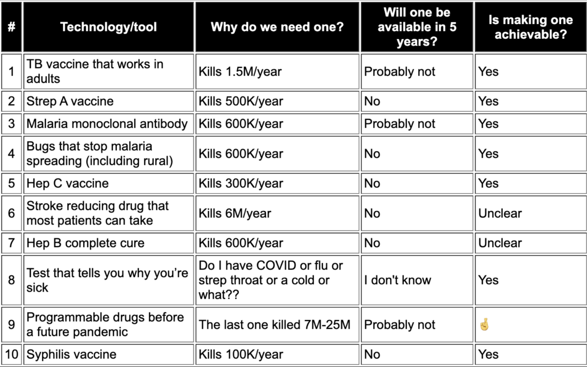
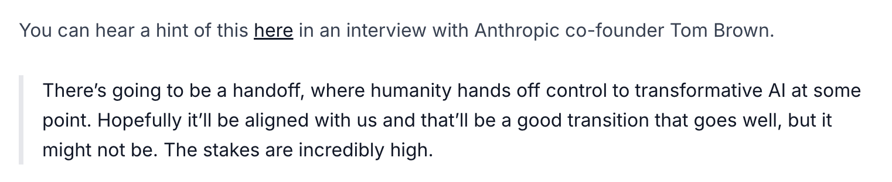

## A better future

[The launch sequences](https://ifp.org/preparing-for-launch/) seem to be really interesting series of papers about AI, but the IFP website has other papers too which are interesting to read!

It has to be the case that non-proliferation of AI technology must be a piece of the solution, as we can compare directly to another technology i.e. nuclear weapons. We collectively made the call that nobody should develop such things. This means routine scanning for AI developments or building of new data centers must take place, and it must be done by an agency like the UN, which does something similar for nuclear weapons, to ensure nobody is able to covertly pursue this.

One of the things stated in the paper is leveraging the fact that AI's improvements are jagged. 

*The future is already here — it's just not very evenly distributed.*

The first step is to predict which are the domains where AI could succeed quickly. Of course, we know by experience, that these are domains which are easily verifiable, such as coding or mathematics. Yet at the same time, it isn't that clear cut. AI has also succeeded in subjective tasks like creating beautiful movies and well-written content. So... it isn't *just* about verification. It's also about the ease of tokenization and deployment. 

## The costs of pausing

This is exactly what I need to read right now. I was an originally AI pilled researcher, who recently became scared of it, and now am uncertain what the right thing to do is. It seems logical for me to stop. If the imminent risks from AI, as per people like Geoffrey Hinton and Yoshua Bengio, is actual extinction, and people in the industry are actually talk about p(doom), stopping makes the most sense to me. Now, let's hear the case for why this may be a costly decision.

Well, this is the exact reason why I was AI pilled in the first place. Yes, the potential benefits are real. 

And that is just in the vaccines side of things, not even medicine as a broad category, and forget about the world as a whole, which is much bigger than just the field of medicine. I personally have around 20% skepticism that all of this would actually happen, which people seem to wholeheartedly accept. It is definitely looking more and more likely given how frontier AI models have been able to find code vulnerabilities and previously unsolved math hypotheses, but... It's tough to compare the risk of existence vs the risks of not getting the proposed benefits.

Is there another option? Not scaling all the way to superintelligence. People seem to think in terms of binary here too. What if we only create AIs that help in those narrow sectors and then stop? Why do we **need** superintelligence itself? I mean, isn't there a balance to be struck here?

Safe to say, the rest of the launch sequence needs to be studied carefully too, but for now, I will continue with the course.

## Utopia for realists

OMG how much resources and reading out there. Instead of marvelling, I need to be hyper aggressive and read them all. It is easy to forget or not even know about how life sucked for most people just decades ago. If you can ask your grandfather or grandmother about disease, death, suffering, sickness that they saw, or perhaps they could enlighten you about what **their** dads and moms went through, this would be clear as day. I ahve the advantage of being born a Nepali, an international student from a third world country, so I got to see some aspects of it, priviledged as I was, I definitely was never blind to it. So this point is clear as day to me. **The lives we lead right now would be how emperors and queens of the past would live,* and this is no overstatement*.** Take something as simple as **access to ice**. In one of his many interesting videos, the MMA coach Firas Zahabi mentioned how for most of human history, having immediate access to ice was not something that was accessible to most humans. Plausibly only people with power, influence, and money, think kings and queens, could request and get that on demand. Yet here we are, in the 21st century, where if I want ice in my water, I can get it from my fridge. We take like this for granted, laughably so, but if we sit and ponder, our life is **filled with luxury**.

A very interesting thing, fromt he years 1300 to 1800, there was a lot of civilizational level inventions, but the average GDP of dountries remained static, for the most part, yet, we know from data that, compared to those days to now, even the countries that are struggling the most are doing much better than the most affluent nations back then. So... what changed?

Somewhere around 1800, the invention of the telephone, cars, the lightbulb, the first dishwasher, these were high leverage inventions, and then the world exploded. It is unrecognizable now, and we've been carrying on with that momentum ever since. Internet connections numbers, people with phones, they far exceeded even the number of people with toilets, although those numbers have probably gone up too from 2014 to 2026. The growth is clear and in a direction pointing towards utopia, really. We are closer than ever.

How about disease, vaccines, and smarts? No more illiteracy! The world is becoming more peaceful, less crime, it is quite incredible to look at history and compare with the present! 

Progress is the realization of utopias, wrote Oscar Wilde, and he would recommend that, once we reach utopia — as it seems we have - we have to rehoist our sails for where to go from here. And onwards we must go. Where is the question, but that is where our work lies. Where indeed, but we must carry on further.

The kind of utopias we imagine tell us about the kind of times we live in. In our history, we once imagined a disease-free future, which we nearly have now, but they reveal what bothered us before. And, indeed, polio, TB, AIDs, measles, chickenpox, smallpox, these were the death of us back in the day, now present no more thanks to vaccines and modern medicine. So... what is our problem now? What kind of utopias can we create? I have some ideas, which I will share below, but first, more content.

> Page 23 typo! "You're not" repeated

And now the authors are beginning to point to the problems that are inherent in our "more civilized" society. Problems of philosophy. Of meaning. Of emptiness. This is precisely what I was about to mention (and I will), but I am happy the authors converged on what i was about to say. Problems of narcissim, too much self-esteem, too little tough love. We are raising pampered princesses, across the board. 
Narcissism up, but also fear/anxiety up. At a glance, paradoxical, but to the observer of the human mind, the human condition, perfectly understandable. Depression. 

> A bitter pill to swallow: we are becoming more and more alike. We consume the same content, think the same thoughts, go through the same experiences, have the same opinions. Diversity of thought = 0. It is capitalism that opened the gates to the Land of Plenty, but capitalism alone cannot sustain it.

Dissatisfaction is an amazing thing because:

a) it is not indifference
b) it points to how we can sketch out our visions for the next utopia

- The perfect is the enemy of the good, Voltaire

## Solarpunk: A Vision for a Sustainable Future

Technology united with nature. An impossible task or some reality to it? I fall into the latter category. We understand more about nature now than every before. In a way, science is an attempt to conquer nature, to understand what makes her tick, how to reverse engineer her. The whole disciplines of physics, math, chemistry, biology is a human attempt to categorize nature, and we have succeed in many things. 100% success in some things, while others are still struggling, but the persuit remains the same. 

It is important to read the works of Solarpunk; it is a literary genre, something that is rooted in hope, as compared to the dystopian cyberpunk. This is exactly in line with the earlier discussion about utopias. 

## Steering the race to AGI

Read Virginia Postrel’s The Future and Its Enemies. Ai safety is very statist is the argument, and it is definitely so. Because, when facing technological innovation of the kind that has been never before entertained by the world, and most of the population has no idea how it works or what is going on, statisicm is the right call. You don't jump into the mid point, the deepest point of the river after just having learnt swimming. It's called dipping your toes slowly into the water, and allowing the progress of the currents to take you further out.

The post addresses Bolstrom's work, which I haven't read yet, but I can guess the kind of thigns he says. The author doesn't like this at all, and takes the opposing view, which I guess is pretty valuable, although I have a feeling it is misguided. Jeremy Howard's post is one I am particularly excited to read because this is THE MAN. FastAI baby. 

I like the arguments here, which isn't rejecting the dangers of AI, but is critical of the centralisation of such a technology. Imagine if only big corporations controlled the mobile phone and internet. That... would have put a stop to all our agency in the past decades. And this is the claim: **a core component of dynamism is human agency**, so do we want people to own their own superintelligences or not? If not, why? If so, why?

## It’s practically impossible to run a big AI company ethically

Anthropic was supposed to be the good guys, right? It certainly seemed to be so, given all their work in mechanistic interpretability, including this amazing finding from a couple days ago: [the J-space](https://www.anthropic.com/research/global-workspace). Yet, at the same time, we see things like Anthropiuc deciding to release Fable **a couple of days after** calling for a stop in AI developments for all companies, fearing that we had reached a critical point in the point of AI development: **recursive self improvement**. The singularity is getting mature now. Oh boy.

They're now pushing back on the California bill for AI regulation, they're taking money from Google/Amazon to build datacenters, they're aggressively scraping data from the internet, violating copyright laws, etc. They're a business after all, which means they will do anything, anything at all, to make sure they make money. They themselves, warned against all the economic pressures of building such a large company, back in their 2022 paper, which is linked in the resources below.

The fact that they're pushing against the bill is twisted. Across many different essays, Dario Amodei has stated that regulation is the path forward, but internally they're pushing away from it, huh? Sneaky. 

> “Anthropic is trying to gut the proposed state regulator and prevent enforcement until after a catastrophe has occurred — that’s like banning the FDA from requiring clinical trials,” says Max Tegmark, president of the Future of Life Institute.

Anthropic is the most aggressive data scrapers out there, ignoring all complaints from YouTube, Freelancer.com., you name it. This is another issue that gets swept under the rug, but the lawsuits keep piling, and content creators are not happy. This kind of careless, who-gives-a-shit-about-the-law attidue is deeply unhealthy.

This is quite an interesting turn of events, I hadn't considered before. Definitely, many more websites are paywalled now than ever before. But the fact that this was done in response to the egregious copyright law infringements by AI companies flew over my head! I was thinking more companies are waking up to the fact that they can enjoy more cash, but no! Over 25% of data from the most popular datasets to train AIs are paywalled now! I don't know the timeframes during which this opinion was collected, but that's fascinating.

Yet at the same time, AI companies assert that synthetic datasets are doing well, and there is no problem with finding data, and "there's a lot more we can find". Not true, it seems, at least without completely ignoring these existing problems. Without answering such questions, companies should not be allowed to plough ahead; this is something that cannot be swept under the rug. Some policy must be created that charts a course for companies to get the data they need without violating copyright laws. An objection I have heard to this is: musicians inspired from other folks create similar music, yet don't have to pay their inspirations royalties because what the former creates is original. But that argument doesn't quite sit right, and it is **NOT** the same.

AI creates different things too, but it is a LITERAL raw material to the creation of the technology, and it is quite different to a musician drawing from inspirations, which is never linear. Sure, Jimi Hendrix was heabvily inspired by BB King and Muddy Waters, but can you do an easy pinpointing of who exactly it was that contributed? No. It really isn't that simple; AI kinda is. We know which sources are fed in, through what channels, what content, and**, in this case, there is a clear law that is being violated, most importantly. ** The companies don't give a solitary fuck, but Jimi did. He didn't break any laws by listening to those artisits. The companies are violating a huge stipulation and continue to do so without warning. If that's the case, why don't I also start stealing from the artwork from neighboring houses to train my own generative AI models? That's ok right? I mean, OpenAI and Anthropic do it, as I am sure everybody else does too. Who cares about copyright law?

## Seeking Stability in the Competition for AI Advantage

This was an interesting article that summarized what another article on AI superintelligence policy talked about. And the TLDR version is this: AI cannot be directly compared to nuclear directly. The technology is qualitatively different, and the situation isn't the same as what we had during the cold war.

Preventing countries from developing their own superintelligence could be seen as an act of war; non-proliferation isn't so easy; the private sector's investments and involvement makes this tricky; and how are we to ensure we are looking at all sides fairly? From China's perspective, the US is *clearly* rushing to become dominant in AI, so wouldn't the strategies from MAIM (the MAD counterpart for AI) get involved here, especially considering that China has in fact given the world open source access to their models, much more than the US (DeepSeek, GLM, Qwen).

## AGI Strategy: Character Cards

So below, I will make a list of all the characters and attempt to classify them; these things are important to know.

**The great powers** = in this context, it would be US and China. They want slightly different things, and, in particular, China wants to break the semiconductor stranglehold US has placed it in, and become a technological force to be reckonwed with, as evidenced by their developments in BCI with Neo.

**AI Companies** = OpenAI, Anthropic, GDM. All of them want to get to AGI first. [CoT Monitoring](https://arxiv.org/pdf/2507.11473) is a particularly interesting paper with industry-wide collaboration! [Low scores in safety across the board](https://futureoflife.org/ai-policy/ai-experts-major-ai-companies-have-significant-safety-gaps/). For all their big talk, Anthropic also has taken up investments from dictatorships... And this is precisely the tension these companies face. Amidst horrenous public backlash, moral and personal convictions, they feel the need to keep driving this forward, to compete, to get there first. Very healthy man. 

**Top AI Talent** = this is where I sit, maybe not top, but rising. Many people have quit, such as Steven Adler (not the GnR drummer!) or Jan Leike and of course Ilya Sutskever, all of whom seem to be concerned about the frontier companies and their march towards AGI without solving the problem of alignment, control, or others.  

## Drivers of AI Progress

FLOP/s is an important term in AI because it is the way we can measure intelligence in the modern era it seems. A FLOP is one computation (addition, multiplication) that a computer performs. Moore's law is applicable here, so we are getting around 1.4x the amount of FLOPs per dollar every year. Compute efficiency is the quality of model you'll get back for an amount of investment, the pound for pound best AI out there will be the most compute efficient. Similarly, we're seeing algorithmic AND compute efficiency getting better each year.

Confusingly, this is different from FLOP is the amount of operations, for training a system, independent of the amount of time it took. Eg. Running an NVIDIA A100 for a week totals 1.179e19 FLOP.

>FLOPs (floating point operations) is a count of total operations performed, not a rate. It's the product of speed × time
>If you run an A100 at speed S for time T, total FLOPs = S × T.
>If you double the speed to 2S but halve the time to T/2, total FLOPs = 2S × T/2 = S × T. Same number.
>It's the same logic as distance = speed × time. Drive at 60mph for 2 hours or 120mph for 1 hour — you've covered the same 120 miles either way. The distance doesn't care how you got there, just like FLOPs don't care whether you used a slower chip for longer or a faster chip for shorter.

But there's obviously physical limitations to how fast you can run something. An A100 has a peak of 312 TFLOP/s for bfloat16. You cannot exceed that number by choice or configuration. It's not a setting, it's physics.

## Two additional papers discussiing compute and algorithmic progress

### Algorithmic Progress in Language Models

Algorithmic progress is tougher to measure than increases in raw compute capabilities or investments in dollars, but this Epoch.AI paper seeks to do just that. And they found that there's a clear decrease in the amount of compute needed (for the same capabilties), so every 8 months there's a doubling of compute efficiency, which beats the Moore's law increases in hardware. To measure this, the researchers fit a Chinchilla style scaling law to the measurement data i.e. over 400 LLMs on a variety of datasets. There are some things worth noticing here:

1. It is tough to separate data-quality and algorithmic progress cleanly
2. Around 60% of the increases were due to compute improvements, with the rest potentially being driven by algorithmic progress OR
3. Data quality
4. Some unique one-time performance gains need to be treated differently, such as the invention of the Transformer architecture in 2017

Accelation was not noted; rather, we see a smooth, linear increase in capabilities. 

### Increased Compute Efficiency and the Diffusion of AI Capabilities

Increased compute efficiency is seen, as described above which means:

1. For the same compute, around next year, we'll be able to do much more. Or, as a corollary, the same performance of this year can be reached for much less compute next year. Other actors will be able to utilize it later
2. The frontier companies, with more investments, will reach to the frontier first. While this is obvious, the data-driven findings emphasizing this makes it more of a truth than hearsay

This is a theory/policy recommendation type paper, so there are no further results to discuss here. These two papers are complementary halves of the same underlying phenomenon, produced by overlapping research communities (Epoch AI's empirical work is cited as the evidentiary backbone of GovAI's theoretical model): Paper 1 measures how fast compute-efficiency actually improves (8.4-month doubling, with compute scaling outweighing algorithms 60–95% to 5–40%), while Paper 2 asks what that measured trend means for who gets access to AI capabilities and when.

The AI Traid:

1. Data
2. Compute
3. Algorithms

> The RL post-training and thinking mode paradigm was important because it pushed the model capabilities to the next level; it found another kind of scaling laws for thinking: "thinking scaling" actually is: a different empirical observation — that for reasoning tasks specifically, model performance continues to improve as you give the model more tokens to reason through before answering. More chain-of-thought = better answers, and this relationship holds across a meaningful range. DeepSeek-R1 and OpenAI o1/o3 are built on this. It's real and it's large. To call it a "scaling law for thinking" is kind of mathematically sloppy because it isn't quite the same as the Kaplan/Chinchilla scaling laws, but the effect is real and documented nonetheless i.e. whether it follows the same clean power-law form with stable exponents across all task types and model sizes is still an active research question.

## The Most Important Time in History Is Now

Overall, the verdict of most forecasters and researchers is that once AGI has been reached, ASI would occur relatively quick thanks to the superintelligence explosion and the AGIs working collaboratively together. This has been hypothesized by Geoffrey Hinton himself. 

If we look at the SWE benchmarks, the AIs of today are at around the top 175th coder in the world, and that is a big deal. The first discipline to go, so far, has been coding and will go next to the AI research itself. Everything is emergent, learnt through reinforcement learning, and nothing that should stop it has been observed. People frequently say data, but it seems less and less likely that such a thing could be the bottleneck. Yes, the AIs are terribly sample inefficient, as compared to humans, but they're also way more general, so that's like saying: a bear can only run X miles per hour versus a cheetah. Well, they're different things entirely, so why make that apples to oranges argument?

Time and time again, we've seen that these machines learn differently to humans, but what matters is that, at tasks we're concerned with, they're as good if not better (so far). Even if it really is 3-5 years away, as Demis Hassabis puts it, where he's wrong is that, that means a lot less time is remaining! Even the conservative ones are saying 3-5 years, which means we need to work on safety **RIGHT NOW**. You prepare for war in times of peace, not after.

**Maybe it is worthwhile taking a look at the kinds of questions in these benchmarks; that would show me how good these systems really are in an empirical manner**.The o1 model had an IQ of around 120, and that was last year... The generalist models are emergently scoring well on specialized tasks. This is evidence of generalization, the gold standard in standard ML!

In a video from 2024, Jensen Huang said we are moving at 100x from Moore's law, compared in the time scale of 10 years. And this has been observed by independent organizations like METR too, where they look at progress in year by year, even there AI progress has beat Moore's law, albeit by a fraction compared to what Huang said. Something like 1.5 times, but that is still significant. o3 actually beats o1 by around 10% in the GPQA Diamond benchmark! Another top of the foodchain benchmark is FrontierMath. 

> o1 = 2%, o3 = 25%

Holy smokes. Recall that Deepseek R1 doesn't require RLHF through GRPO. 

> “As soon as it works, no one calls it AI anymore.”

An element of recursive self-improvement that I never thought about before was that, with each additional improvement, the AIs of tomorrow will start getting smarter, right? Well, the next evolution of the model will make even more gains because the last generation was so capable. And so on. So each additional jump will become wider and wider, which is the scariest part.

The history of humanity has followed a general rule: our intelligence is what gives us power over all other animals. And with superintelligent AI, that will no longer be the case. Which suggests... 

According to Tim Urban, the majority of people think positively about AI. Well that has certainly changed, since LLMs, no? Now, in my opinion, most people are fearful of AI, as even commonday people mistrust it, fear it will take their jobs, and displace them completely; forget about actual researchers, who **know that it is true** and they fear the additional dangerous parts of AI. 

## What might success look like?

It is tough to even think about what success looks like for a technology that doesn't exist yet. In a way, it is a huge victory of humnanity to even pause and think: what the hell are we doing? That is, many people have woken up to the idea that this couldbe dangerous and to have an inkling of an idea of how we could do this positively, we want to start thinking about how what dramatic success or failure could look like!

1. Govt controls AGI

This option contains all the ideas that situational awareness AI proposed as well as ideas like CERN for AI. Extremely secure, small number of people involved, *hopefully third party agency personnel too*. 

2. Hand off to superintelligence

Now this is the one I don't like too much. I am uncertain if this is approach we should take, although ai-2040 did, at the end, hand it off to superintelligence too, but in that situation, it was hard fought for. We only do so after a huge amount of agreement amongst experts that alignment has been solved, back tested over and over again to make sure AGI wasn't simply fooling us and *biding its time*. So to San Francisco house parties to hear tech executives talk about this: **it isn't explicit, but this is the implicit goal and desire of AI researchers and executives**. 

3. Build defenses to dilute AGI

This is the mirror to option 2. that I have created below, which is handing off AGI to everyone, like the internet. But to do that safely and effective, we'd need to *dilute AGI somewhat*. To make it safer, presumably.

Here's there's a big danger to this: "protective technologies outpace destructive technologies". Some technologies are offense oriented, meaning it would be difficult (if not impossible) to build defenses around it. Example, nanobot technology becoming wisespread, recursively self replicating, and then eating all the carbon atoms in the entirely world. Safe to say, this would incredibly difficult to create defense technologies that stop such a recursive explosion of nanobots doing this, but... that's just one of the many dangers. Mirror life is another one. Or even, pandemics created by bad actors here. 

Who would have imagined that the internet would eventually have a dark side where all sorts of illegal things take place; that's just human nature, but the problem here is, the dispropportionate impact bad actors can have with this. The arguments in this section is very 50-50, which is not convincing at all. 

Anthropic's Constitutional AI isn't all that great, to be completely honest. Sampling biases and what if the AIs that generate the RLAIF itself is secretly backdoored? Or adversarially misaligned and was only faking its "good" alignment? 

> What is the ratio to which defense technologies need to be created in response to offense technologies? Doing this kind of analysis in cyber warfare and nuclear could be informative because AI could be similar that the defese technologies need to be X amount more than the offense technologies, more = resources, energy, creative, just plain awesome

There are some missing options here that I will add:

1. Diffuse AGI just like the internet. Nobody owns the internet, even though it was primarily the United States DoD (also the GPS). 
2. Hand off control to private companies

Now, of course, even the options I added aren't foolproof; in fact, the second option in particular is reall, really bad IMO, but it needs to be said to be extremely precise.

I particularly like aitreaty.org's proposals. Global compute thresholds (with detection if any actor has been found messing with that through the new complaince comission similar to the IRA but for the entire world), the establishment of a 3rd party expert agency like CERN for AI Safety (like the IAEA), and safe APIs for public use and good.

> Experimental idea: design a cryptographic trip-wire kill switch using cryptography. Through this, an LLM can press the kill switch, it is subtly shown. Train the AI to never press the button, but force it onto a situation where it will be keen to do so. Use this scenario to test honeypots, alignment faking, to track how many times AI agents decide to hit the kill switch button, which actually will just turn them off

## Further Reading

- https://www.whitehouse.gov/wp-content/uploads/2025/07/Americas-AI-Action-Plan.pdf
- [Nick Bostrom](https://nickbostrom.com/papers/vulnerable.pdf)
- https://hai.stanford.edu/assets/files/hai-policy-brief-what-makes-a-good-ai-benchmark.pdf
- https://ifp.org/unlocking-a-million-times-more-data-for-ai/
- https://aws.amazon.com/blogs/publicsector/aws-partners-help-public-sector-organizations-harness-the-power-of-data/
- https://ifp.org/mapping-the-brain-for-alignment/
- https://ifp.org/preventing-ai-sleeper-agents/
- https://blog.google/innovation-and-ai/technology/safety-security/cybersecurity-updates-summer-2025/
- https://www.futurehouse.org/
- [Remeber these guys. Arc Institute, GoodFire](https://arcinstitute.org/news/evo2)
- https://sseh.uchicago.edu/doc/von_Neumann_1955.pdf and https://www.amazon.com/-/es/Neumann-Compendium-Scientific-Century-Mathematics/dp/9810222017
- https://dl.acm.org/doi/pdf/10.1145/3531146.3533229
- [Utopia for realists](https://drive.google.com/file/d/1nh-Km2J2C99s_LYxby-N53EnZgM2uXHZ/view)
- https://arxiv.org/pdf/2307.03718
- https://www.fast.ai/posts/2023-11-07-dislightenment.html
- https://cset.georgetown.edu/article/regulating-the-ai-frontier-design-choices-and-constraints/
- https://www.transformernews.ai/p/sam-altman-was-outright-lying-to
- https://drive.google.com/file/d/1JVPc3ObMP1L2a53T5LA1xxKXM6DAwEiC/view
  