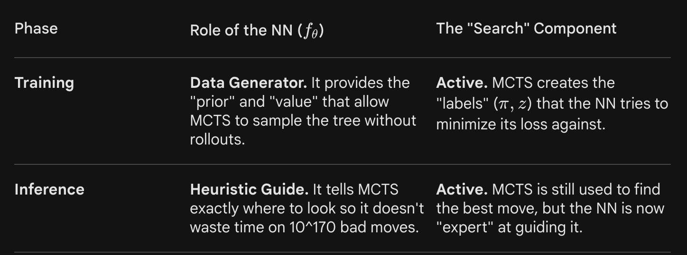

# AlphaGo, the baseline version

This big news actually occurred exactly 10 years ago now, which is crazy if you think about it. What has happened in the field of AI since has been crazy, but let's revisit this important topic, as it is still relevant. As per my understanding, this initially showed how important RL was, and now that most frontier AI labs are rushing to scale up RL training just as they did for pretraining language models, it is an interesting paper to revist.

The game of Go is a Googol ($10^{100}$) times more complex than chess, so it was considered a huge problem for AI. I mean, the amount of tree searching and pruning required for chess, scaled up vastly, as you can imagine is a notoriously difficult problem to do and do it efficiently on top of that. We're talking about more board confirgurations than the number of atoms in the universe. 

So how did AlphaGo do it? Deep neural networks and advanced search algorithms working in combination. Two neural networks:

1. The policy network = selects the next move
2. The value network = predicts the winner of the game

The 18 time winner of Go says that AlphaGo is "creative". It is a point well taken because, after all, what is creativity? It is a novel method of thinking, let's call it lateral thinking, because even experts don't see it coming. AlphaGo probably made a novel decision in a situation in a data-driven way, which comes across as creativity, which it really is. We consider a person to be creative when they do this; why is it that we cannot say the same when a machine does that?

AlphaGo used Monte-Carlo tree search instead of doing something brute force, which is what DeepBlue did in 1997 to beat the chess champion at that time, Garry Kasparov. But unlike a pure MC tree search, it also used NNs in combination. After tons of RL training, the MC tree searches were not even needed, just the raw networks were enough to beat SOTA go programs that built massive search trees. The policy networks were used to train the value networks through RL. 

> A historical note - DQN (Deep Q-Network. Q-learning + deep NNs) was used in 2015 to achieve SOTA performance in Atari games. It used experience replay as a big time teacher. The inputs given to the system was only raw pixels.

## AlphaGo: Zero

Initially, AlphaGo played thousands of games with professionals too. AlphaGo Zero on the other hand, started from scratch and learnt to play at the highest level entirely by itself. Remarkable. 

AlphaGo Zero beats AlphaGo, the champion defeater, after 40 days of training. It also combines both the above neural networks into one. No hand engineered features for it, beginning entirely from a new state. This version beats AlphaGo 100 games to 0. Mindblowing. AlphaGo Zero is unconstrained by biased and limited human knowledge, creating entirely new moves and strategies, which have since been studied by Go experts. It learnt thousands of years of human knowledge in just days...

## The paper: Mastering the game of Go without human knowledge

The policy network for AlphaGo Fan was trained using a supervised learning phase and then policy gradient RL. One of the two main families of RL algorithms are policy gradient and value-based.

1. Policy gradient = PPO
2. Value phase = Q-learning, DQN, etc

Once trained, the MCTS was combined with the networks, "to provide a lookahead search, using the policy network to narrow down the search to high-probability moves, and using the value network (in conjunction with Monte Carlo rollouts using a fast rollout policy) to evaluate positions in the tree".

> No MC rollouts for AlphaGo Zero

## RL in AlphaGo Zero

AlphaGo Zero uses a deep neural network with parameters $\theta$.  The inputs are raw board representations of the position and history and outputs both the move probabilities and the value, hence they call this a merged version of both networks. The network itself is pretty basic: multiple residual blocks of convolutional layers with batch normalization and (ReLU?) nonlinearities.

In each position s, MCTS search is executed, but it's guided by the network. The output of the MCTS is probabilities $\pi$ of playing each move. This is how they were able to see that move 78 that Lee Sedol played in game 4 was a 1 in 10000, the god move. And also, move 37 played by AlphaGo itself was a move tremendously unlikely to be played by a human, concluded by AlphaGo itself. Yet, it chose to play it. Why...?

MCTS told it to pick move 37, a shoulder on the fifth line. The neural network alone didn't choose move 37. The network gives a prior probability over all moves — its initial guess based on pattern recognition from self-play. Move 37 probably had a low prior. A human-trained network would have had an even lower prior.

But then MCTS runs on top of that prior. It simulates thousands of game continuations from the current position, guided but not dictated by the network's probabilities. During those simulations, move 37 kept leading to winning positions — not obviously, not immediately, but across thousands of rollouts looking many moves deep.

AlphaGo Zero doesn't have rollouts. While these were helpful to aggregate the performance of move 37, it wasn't strictly needed. AlphaGo Zero would be able to play move 37 too, WITHOUT such rollouts. Non-intuive, clever, but still performant. 

The value network in AlphaGo Zero, trained purely through self-play against itself at full strength, gives a much more accurate estimate of position value without needing to simulate to the end. It learned to compress thousands of moves of lookahead into a single number — accurately. The value network is essentially doing the rollout implicitly — it has internalized what good play looks like across millions of self-play games and can evaluate a position directly without simulating forward.

### So why no new findings using these approaches besides AlphaFold?

What's Missing — The Three ConstraintsAlphaGo Zero worked because three conditions were simultaneously true:

1. A perfect simulator existed

    The rules of Go are complete, deterministic, and computable. You can simulate millions of games exactly. The environment is closed — nothing happens outside the rules.

2. A clear reward signal existed

    Win or lose. Binary, unambiguous, available at game end. No debate about what counts as success.
    
3. The action space was bounded. 

    A 19×19 board. 361 possible moves plus pass. Large but finite and structured. 
    
Remove any one of these and the AlphaGo Zero approach breaks or becomes dramatically harder.

### Why It Hasn't Been Applied Everywhere

Most real domains violate at least one condition:

Domain              Simulator?   Clear reward?   Bounded actions?
──────────────────────────────────────────────────────────────────
Go                  ✓ perfect    ✓ win/lose      ✓ 361 moves
Chess               ✓ perfect    ✓ win/lose      ✓ ~35/position
Protein folding     ✓ physics    ✓ energy min    ✓ angles
Drug discovery      ✗ partial    ✗ noisy         ✗ vast
Climate policy      ✗ none       ✗ contested     ✗ infinite
Human relationships ✗ none       ✗ undefined     ✗ infinite
Scientific discovery ✗ none      ✗ undefined     ✗ infinite
Economics           ✗ partial    ✗ contested     ✗ infinite

AlphaFold worked because physics gives you a simulator (energy functions) and a reward signal (minimum free energy). The protein folds to its lowest energy state — that's the objective, defined by nature itself.

Drug discovery is harder because binding affinity is expensive to measure, the molecule space is astronomically large, and "does this cure the disease" takes years to know.

The Deeper Problem: even where simulators exist, there's a subtler issue ->  Goodhart's Law.

> When the measure becomes the target, it ceases to be a good measure.

AlphaGo's reward — win the game — is perfectly aligned with what we actually want. Winning Go IS the goal. There's no gap between the proxy and the real objective.In most real domains that gap is enormous. Optimize for GDP and you get inequality. Optimize for clicks and you get outrage. Optimize for test scores and you get teaching to the test. The moment you define a reward function precisely enough for an RL agent to optimize, you've probably already distorted what you actually wanted.

This is the alignment problem in its most fundamental form. AlphaGo Zero solved it by working in a domain where the proxy and the goal are identical. Most of the world isn't like that.

### What Has Been Applied

The ideas have propagated, just more slowly than you'd expect:

AlphaGo Zero → AlphaZero (chess, shogi, Go unified)
             → MuZero and Sampled MuZero (learns the simulator too, 
                       no rules given — bigger leap)
             → AlphaFold (protein structure)
             → AlphaTensor (discovers matrix multiplication algorithms)
             → AlphaCode (competitive programming)
             → AlphaProof (mathematical theorem proving)
             → Isomorphic Labs (drug discovery)
             → Waymo, robotics (partial — simulator problem)
             
AlphaTensor is the one that stunned mathematicians — it discovered faster matrix multiplication algorithms than humans had found in 50 years. Same paradigm: define the problem as a game, define winning precisely, let self-play find the answer.AlphaProof is the most recent and arguably the most significant — it proved IMO-level mathematics problems. Mathematical proof has a perfect simulator (formal logic) and a clear reward (valid proof or not). Same conditions as Go. Same result — superhuman performance.

### What's Actually Missing

Three open frontiers where the AlphaGo Zero paradigm could explode but hasn't yet:

- Building simulators for domains that don't have them
World models — neural networks that learn to simulate environments from data rather than from explicit rules. 

MuZero was a step toward this. The frontier is: can you learn a good enough world model of, say, a biological cell to do AlphaGo Zero-style search in drug design?

Reward specification for complex human values. This is the alignment problem directly. Can you define "human flourishing" precisely enough to optimize for it? Constitutional AI is one approach. RLHF is another. Nobody has solved this.

### Transferring across domains

AlphaGo Zero's Go knowledge is useless for chess. AlphaZero trained from scratch on each game separately. The dream is an agent that transfers — that uses what it learned about strategic thinking in Go to bootstrap faster in a new domain. This is the meta-learning frontier. Largely unsolved.

### The Einstein Parallel Extended

It's true that this is the Go equivalent of relativity. AlphaGo demonstrated creativity in its games, as concluded by Lee Sedol. After all, what is creativity if not questioning assumptions without bias and coming up with new conclusions, ones never foreseen by others? Isn't that what Einstein did with relativity? No other physicist before him had questioned prior paradigms and come up with novel approaches, which is what broke physics and cemented Einstein as one of the greatest sceintists of all time.

Einstein's relativity was discovered in 1905. The applications — GPS, nuclear energy, particle accelerators, lasers — took 50-100 years to fully materialize. Not because people weren't trying, but because each application required solving additional hard problems that relativity alone didn't solve.

AlphaGo Zero is 2017. We're 8 years in. The AlphaFolds and AlphaTensors are the early applications — the equivalent of the photoelectric effect and E=mc². The GPS equivalents — the transformative applications embedded in daily life — are probably still 10-20 years out.

The missing piece isn't insight. It's infrastructure, compute, and crucially — finding the domains where the three conditions hold or can be engineered to hold.
That last part is a research agenda. Finding domains where you can build a good enough simulator, define a clean enough reward, and bound the action space enough to apply self-play RL — and then doing the AlphaGo Zero thing there — that's a decade of work for a generation of researchers.

## More on the paper

> "The main idea of our reinforcement learning algorithm is to use these search operators repeatedly in a policy iteration procedure22,23: the neural network’s parameters are updated to make the move probabilities and value (p, v) = fθ(s) more closely match the improved search probabilities and self-play winner (π, z); these new parameters are used in the next iteration of self-play to make the search even stronger."

AlphaGo Zero began Tabula Rasa. For each board state $s_t$, it is calculating $\pi_1, \pi_2, ... , \pi_{T}$, which are the branching trees. The $\pi{s}$ are probability distributions, the ground truth of what the best move is on the basis of the lookahead.

As for the NN training, the NN calculates two "heads" for each of the above board states. 

1. $p_t$ (Policy Head): A vector representing the probability of selecting each move.

2. $v_t$ (Value Head): A scalar representing the probability of the current player winning from that position.

The loss function tries to minimize the NNs prediction's to the MCTS tree search. But, the counterintuitive thing is: In AlphaGo Zero, the neural network does help the MCTS during training, even when the weights are initially random. It's not a circular dependency. 

At the very beginning ($i=0$), the weights $\theta$ are random.The MCTS at $i=0$: It uses the random NN to get a prior probability $p$ and a value $v$. Since the NN is garbage, $p$ is essentially a uniform distribution and $v$ is noise.The "Search Advantage": Even with random guidance, MCTS is still a search. It explores the game tree. By simply looking a few moves ahead and seeing which branches lead to a win (even if the evaluation at the leaf is random), it generates a policy $\pi$ that is slightly better than pure randomness.

AlphaGo Zero isn't just "training"; it is Policy Iteration. In reinforcement learning, this is the classic $f_\theta \to \text{MCTS} \to f_{\theta'}$ loop.

1. Step A (Self-Play): The current NN ($f_{\theta_i}$) guides the MCTS. 

The search acts as a policy improver. It takes the "weak" raw intuition of the NN and uses lookahead to create a "strong" move ($\pi$).

2. Step B (Optimization): The NN ($f_{\theta_{i+1}}$) is trained to predict the results of that search ($\pi$ and $z$). 

This is the policy evaluation step. The NN is "distilling" the search's hard-earned knowledge into its own weights.The Recursive Logic: The NN isn't just helping the MCTS; the MCTS is amplifying the NN. The search takes whatever signal (however noisy) the NN has and makes it stronger. Then the NN learns that stronger signal.

The distinction between training and inference can be detailed like so:

> TLDR - The NN is the Intuition; MCTS is the Deliberation. In AlphaGo Zero, Deliberation is used to train Intuition, and Intuition is used to speed up Deliberation.

The Elo scale was used as a metric for AlphaGo Zero, at least for one of the visuals. The same metric that calculates the performance of an agent in adversarial games like Chess, Go, or Snakes and Ladders. 

**AlphaGo Zero outperformed AlphaGo Lee just after 36 hours of training**

- AlphaGo Zero used a single machine with 4 tensor processing units (TPUs)
- AlphaGo Lee was distributed over many machines and used 48 TPUs

The DeepMind team did something interesting after training AlphaGo Zero; they trained another neural network that's sole purpose is to predict the moves that expert human players would do. While the network was successful in doing so, AlphaGo Zero, the self play trained agent, was able to defeat the human-trained agent, suggesting that AGZ is learning something qualitatively different to human players. I mean, that much is obvious given even AlphaGo and the remarks Lee Sedol made, and that wasn't even AGZ.

An interesting observation - surprisingly, shicho (‘ladder’ capture sequences that may span the whole board)—one of the first elements of Go knowledge learned by humans—were only understood by AlphaGo Zero much later in training.

TLDR - a pure reinforcement learning approach requires just a few more hours to train, and achieves much better asymptotic performance, compared to training on human expert data

## Methods

Policy iteration - alters between estimation of the value function and policy improvement (policy evaluation), iteratively hence the name. A simple way to evaluate the policy is to estimate the value function through sampled trajectories of outcomes. And likewise, a simple approach to policy improvement is to greedily select actions based on the value function.  In large state spaces, approximations are necessary to evaluate each policy and to represent its improvement.

The AlphaGo Zero self-play algorithm can similarly be understood as an approximate policy iteration scheme in which MCTS is used for both policy improvement and policy evaluation.

## Future resources and roadmap for RL

- Redo Sutton and Barto
- Spinning Up in Deep RL — OpenAI
- Deep RL course by Hugging Face
- DQN (Mnih et al. 2015), A3C (Mnih et al. 2016), PPO (Schulman et al. 2017), SAC (Haarnoja et al. 2018), TRPO (Schulman et al. 2015) 
- InstructGPT (Ouyang et al. 2022), Constitutional AI (Revisited), GRPO (DeepSeek 2024, replaces PPO in R1), DeepSeek R1 (2025), Let Me Think (various 2024-25)
- Reinforcement Learning: Theory and Algorithms by Kakade
- Direct Preference Optimization: Your Language Model is Secretly a Reward Model
Rafailov, Sharma, Mitchell, Ermon, Manning, Finn — Stanford, 2023. Lilian Weng's blog (lilianweng.github.io) — her post "Alignment: RLHF and Beyond" covers DPO in context alongside PPO and RLHF. 

### Recommended timeline

Phase 1 (1-2 months):
├── Spinning Up implementation of PPO from scratch
├── Train on simple gym environment (CartPole → LunarLander)
└── Understand the code deeply, not just run it

Phase 2 (2-3 months):
├── Read GRPO paper
├── Implement GRPO on a small LLM (Qwen 1.5B or Gemma 2B)
├── Compare with your CAI experiments — same model,
    different training signal
└── Post on Scorpion Labs

Phase 3 (August onwards, combines with Evo2):
├── Process reward models on reasoning tasks
├── RL applied to genomic sequence models
└── Mechanistic interpretability of RL-trained models
    (how does the policy circuit differ from SL circuit?)

That last question — what does RL training do to the internal circuits a model uses? — is almost completely unstudied. BizzaroWorld found the factual recall circuit in a pretrained model. What happens to that circuit after RLHF? After CAI? That's a paper nobody has written yet and it sits exactly at the intersection of your four pillars.

## Non-stationary environments and large state spaces

Self driving cars will be drawn on heavily because they face similar problems and are performing well. What can we learn about top tier systems that use RL to train agents to deal with this?

1. Mastering Atari, Go, Chess and Shogi by Planning with a Learned Model (MuZero) (Schrittwieser et al., DeepMind, 2019)

2. Planning in Complex Objective Spaces (Sampled MuZero) (Hubert et al., DeepMind, 2021)

3. Learning to Drive in a Day (Kendall et al., Wayve, 2018)

4. Model-Based Imitation Learning for Urban Driving (MILE) (Wayve / Valeo, 2022)

5. Mastering Diverse Domains through World Models (DreamerV3) (Hafner et al., 2023)

6. Andrej Karpathy - CVPR 2021 Keynote on Tesla Autopilot

7. Andrej Karpathy - Tesla AI Day 2021 / 2022

8. Learning to Drive in a Day

9. MILE

10. World Models" (Ha and Schmidhuber, 2018) 

Waymo: HD maps + classical planning + learned components
Wayve: end-to-end learned world model, minimal priors
Tesla: massive supervised learning on human demonstrations + neural planner

Three different philosophies, all working at different levels. The comparison between them is itself a research paper waiting to be written from a mech interp perspective — what did each system learn, and how does the internal representation differ based on the training approach?