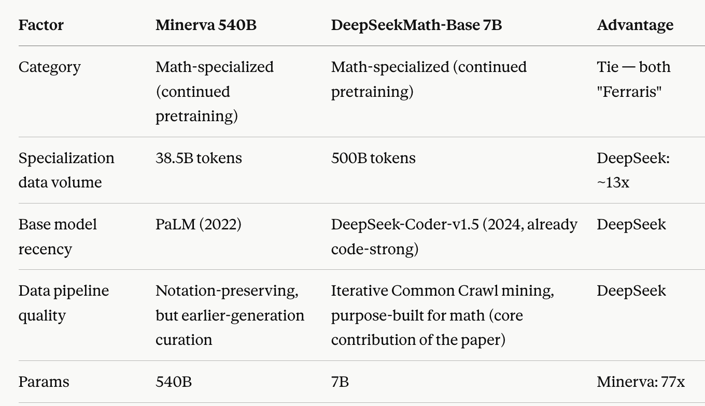

The papers studied in this batch: 

1. https://arxiv.org/pdf/2402.03300

## DeepSeekMath: Pushing the Limits of Mathematical Reasoning in Open Language Models

The two important contributions made in this paper was GRPO (a variant of the PPO RL training algorithm) and a way to mine math webpages in a smarter way, that ultimately produces a much smarter model, pound for pound, in terms of parameters.

PPO, the SOTA algorithm for RLHF/RLVR (RL Verifiable Rewards), uses four models simulataneously. 

1. Policy = LLM being trained that produces responses
2. Reward = the model that evaluates responses and provides a score, using a reward function
3. Value model/critic = *a separate learning network* that predicts how good transitioning to a particular state from another state is going to be i.e. an estimate of future expected reward. This is how the **advantage** variable is calculated, which is simply the difference of this value and the actual reward. Training on the advantage reduces variance
4. Reference model = a frozen copy of the original policy, so it doesn't drift way too far, using KL divergence to penalize drifts

The value model is a full neural network, oftentimes the same size as the original policy model, that has to be trained alongside the policy, so this is the expensive bit that GRPO removes. The value model's work is replaced by sampling a group of outputs from the same prompt, scoring all of them with the reward model, and using the group's mean reward as the baseline. This is a Monte Carlo estimate of the baseline instead of a learned one. GRPO is susceptible to reward hacking, where the group reward becomes dominated by the higher-variance objective.

Corpus Construction: this was the version of the model that was trained on math problems, with the initial seed from OpenWebMath. 

The crazy thing is that the DeepSeek 7B version trained in thsi way beat Minerva's 540B version, yet it is epistemically honest of us to compare whether the former is a specialized model or not, hence not making this comparison fair. Yet, it seems it is comparable, as this description shows!

The paper's finding isn't "small beats big" — it's "aggressive, purpose-built data curation at scale (500B tokens) can substitute for 77x parameter count." That's still a genuinely useful result: data quality as a lever independent of scale, but the "beats Minerva 540B" framing in the paper's abstract is doing more rhetorical work than the underlying comparison supports. Both models are math-specialized via continued pretraining — this isn't a specialist-vs-generalist comparison. The real asymmetry is specialization data volume: DeepSeekMath-Base trained on 500B math-focused tokens vs. Minerva's 38.5B, a ~13x difference, on top of a more modern base model and data pipeline. Minerva's only structural advantage is 77x more parameters. The paper's claim is best read as "more/better specialization data can outweigh a 77x parameter deficit," not "small generalist-adjacent model beats big specialized model.

There are many checkpoints available on HuggingFace and the GitHub repository is completely open! 

