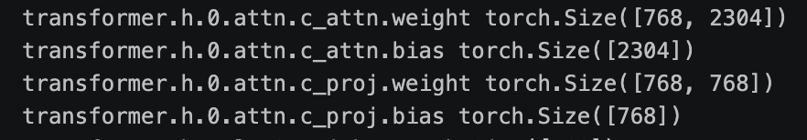
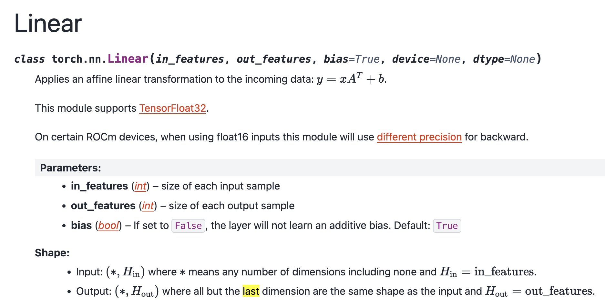
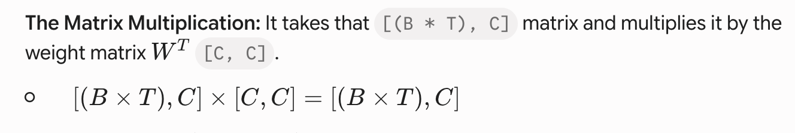
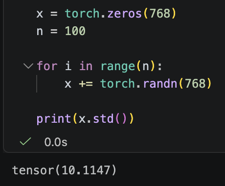

## Let's reproduce GPT-2 (124M)

The positional embeddings were set from the sinusoidal distribution in the Attention is All You Need paper, but in the GPT-2 paper, they set it as a learnable parameter, which seems to work well. According to AK, the jagged nature of the curves (when you pull out random embedding vectors and plot them) shows that the network wasn't fully trained. 

We will be training the 124M parameter version with 12 layers and $d_{model}$=768.

> https://github.com/huggingface/transformers/tree/main/src/transformers/models

> That is an awesome resource to read through because it has PyTorch based model implementation for many transformers, including GPT-2 and AK advises using this version 

And when we load the GPT-2 model itself, we can clearly see weights of the model, that's exactly what we get i.e. [50257, 768], where the 50257 bit is the vocabulary size for GPT-2.

wte = token embeddings
wpe = positional embeddings, which is 1024 only because that is the sequence length i.e. the context window or length

> seq_len, block_size, context window, and context length all refer to the same things

As a reminder, GPT-2 was a modified version of the original AIAYN paper which was an encoder-decoder structure using cross attention from the encoder, in particular for the V vectors. GPT-2 is decoder only and uses only self attention. Two other differences:

1. The LayerNorm becomes pre instead of post
2. An additionla LayerNorm was addeed after the final self attention block

> nn.Linear(in_features, out_features) stores its weight matrix as shape [out_features, in_features] — this is PyTorch's convention, so the final lm_head component should be outputting a tensor of [vocab_size, d_model], but it'll be implemented as nn.Linear(d_model, vocab_size)

- GPT-2 uses no bias in the final projection (lm_head), I wonder why. Something to explore! 

As we dig into the transformer blocks themselves, we see something interesting. GPT-2 fuses Q, K, and V into a single combined matrix rather than having three separate ones. That is, only the input projection, which fuses all three vectors (Q, K, and V) into one i.e. 768 * 3 = 2304. But the output projection remains at d_model i.e. 768.

That's why we see something like this: 



Attention is a communication mechanistic, a pooling function, something that does a sort of weighted sum or aggregates. MLP works individually on each token, so it is a mapping function! Both of them working together is kind of like an application of MapReduce. The MLP sublayer just scales up the input (d_model) 4 times up, for some reason that is probably explained in the paper. The projection matrix takes it back down, as explained in the theory.

GELU is like ReLU, except it is not exactly 0 at 0. There's a small bump. A slightly smoother ReLU. There are two versions of GeLU, the normal and approximate version, which exists for some reasons; although, there's no reason good reason today for this. A historical artifact.

> Dead ReLU neuron problem. 0 gradient at the 0 point, which isn't preferred of course

> Modern networks like LLaMa 3 has SwiGLU, which do similar things, but there's some research taste thing going on here!

AK uses register_buffer with a bias which has nothing to do with the transformer layers' biases as we're seeing and expect, the y = mx + b kind of bias. It is the causal mask that is important to make the model auto-regressive, actually! As we can see within the register buffer bit, we're creating a square matrix (seq_len by seq_len) which is trilled such that a token cannot look into the future, in the triangular matrix fashion.

It is confusingly called "bias" instead of the self attention mask; that is only historical baggage. And as for why it is added via register buffer instead of a normal tensor, it's because, in PyTorch, register_buffer is used for tensors that are stateful but not learnable.

Because it is registered, when you call model.to('cuda'), PyTorch knows to move this mask to the GPU alongside your model weights.

But, because it is a buffer and not an nn.Parameter, PyTorch knows not to calculate gradients for it. The optimizer will never try to "update" the 1s and 0s in the triangle.

## The CausalSelfAttention Forward Pass

This is the most complicated bit so far, so it is important to understand what's truly going on. We have [Batch Size, Sequence Length, d_model] (or B, T, C in the code) coming out of the c_attn bit, which is a simple Linear layer taking in d_model and then multiplying it by 3 for Q, K, and V vectors, but this is **not** just a simple 1D array. It is a [B, T, C (d_model)] dimensional. 

With this prose, we're trying to understand this particular bit of code:

```
k = k.view(B, T, self.n_head, C // self.n_head).transpose(1, 2) # For the k vector, but this operation is the same for all K, Q, and V vectors
```

> The PyTorch documentation for torch.nn.Linear specifies that the linear layer operates on the last dimension of the input tensor.



So, the 3D tensor's last dimension i.e. C or d_model is the one that expands three times. So, before the view operation, our input tensor is of shape [B, T, 3*C], and this is the one that is split by n_embd in dim=2. So, we get three tensors, which need to get reshaped and transposed now.

So, taking just the k vector for instance, this is [B, T, C], where C is d_model. We also have d_head defined, so C will need to get divided by n_heads. And that is exactly what the view bit does. But it also adds the n_heads bit into the entire array, so the 3D tensor becomes 4D i.e. [B, T, n_heads, d_head], where d_head = d_model / n_heads.

The transpose is needed so dimensions 1 and 2 are swapped, which means it becomes [B, n_heads, T, d_head]. **This has to be done in order for the math, the matrix multiplication in the next step, to work out**.

In the next step of the Transformer, we have to multiply the Queries by the Keys to get our attention scores, and for this, PyTorch uses Batched Matrix Multiplication.

### The Rule of Batched Matrix Multiplication:

When PyTorch multiplies two multi-dimensional tensors together, it treats the first dimensions as a batch and only performs matrix multiplication on the last two dimensions. Let's take an example where n_head is 12 and d_head = 64 i.e. d_model = 768.

- If we DO NOT transpose:

Our shape is [B, T, 12, 64].

PyTorch would look at the last two dimensions and try to do matrix multiplication on a 12 x 64 matrix. This makes zero mathematical sense. We don't want to multiply "Heads" by "Head Size".

- If we DO transpose:

Our shape becomes [B, 12, T, 64].

Now, PyTorch looks at this and says: "Okay, I have a batch of size B * 12. For every single one of those, I need to do matrix operations on a matrix of shape [T, 64]."

In PyTorch, the @ operator calls torch.matmul.torch.matmul operates strictly based on the number of dimensions of the input tensors: if both inputs are 2D ([M, K] and [K, N]), it performs standard matrix multiplication $\rightarrow$ [M, N].

If inputs are $>2$D (e.g., 4D tensors like [B, T, n_head, d_head]), PyTorch automatically treats all leading dimensions as batch dimensions and only performs matrix multiplication on the last two dimensions.

So, if we don't transpose, we end up with an interaction matrix between Head $i$ and Head $j$, for the query and keys. The attention mechanism is trying to measure that for the *tokens*, which is why we need to transpose the n_head dimension with T, the seq_length.

> In theory, if we don't do the transpose, we'd get an interaction matrix between the heads for Q and K, which seems useful in a mechanistic interpretability sense, but maybe it isn't useful even though the linear algebra does seem to work out. Heads are Parallel, Independent Operators: In a Transformer layer, attention heads run completely independently in parallel. Head 1 has no direct wire or channel to send information to Head 2 during the attention step.Where Heads Actually Interact (The Residual Stream): Heads only interact after the attention calculation is done. Each head projects its output back into the shared residual stream via $W_O$ (c_proj), where their outputs are summed together:

#### A Simple Example

Imagine a tiny sequence of 3 tokens (T=3), an embedding size of 4, split into 2 heads, head Size = 2.

If we transpose to [B, 2, 3, 2], we have completely isolated the heads.
If you look inside Head 1, you see a matrix shaped [3, 2] (3 tokens, each with a 2-dimensional vector).

When you multiply the Query matrix [3, 2] by the transposed Key matrix [2, 3], the inner dimensions cancel out, and you are left with a [3, 3] matrix.

That [3, 3] matrix is your Attention Grid! It tells you exactly how much Token 1 attends to Token 1, Token 2, and Token 3.

Summary: We transpose so that the "Number of Heads" becomes a batch dimension, isolating each head completely. This places "Sequence 

Length" and "Head Size" at the very end of the tensor, aligning them perfectly for PyTorch to multiply the tokens against each other to calculate attention.

Now the next bit calculates the attention scores, masks the 0's to be negative infinity for the softmax to work well, and calculates the softmax.

### Explanations here

```
att = (q @ k.transpose(-2, -1)) * (1.0 / math.sqrt(k.size(-1)))

att = att.masked_fill(self.bias[:, :, :T, :T] == 0, float("-inf"))

att = F.softmax(att, dim=-1)
```

1. The Negative Index in Transpose: k.transpose(-2, -1)

> In Python and PyTorch, negative indices simply mean "count backward from the end.". So this switching of the k is necessary for the multiplication of q and k to work, and that's it. The multiplication works and we have a matrix that is [B, n_heads, T, T], the attention score matrix. The negative indices is just done as cleaner code. Theoretically, if you do multi-GPU training, you'd add yet another batch dimension, so instead of referring to the dimensions through static numbers, done using negative indices is cleaner code.

2. What is masked_fill doing with self.bias[:, :, :T, :T]?

> When the self.bias gets created, it was a square matrix of [1, 1, block_size, block_size], so when the data comes in, it may be smaller than block_size, the entire context window. By slicing the mask as [:, :, :T, :T], you are telling PyTorch: "Take the first T rows and the first T columns of the giant block_size mask." This ensures that the mask shrinks to exactly match the [T, T] shape of your current att tensor. Since self.bias is a lower-triangular matrix of 1s, the upper-right triangle consists of 0s. For every position in the att tensor where the corresponding mask value is 0 (i.e., token $i$ trying to look at future token $j$), masked_fill overwrites the attention score with -inf.

3. Why dim=-1 in Softmax?

> Softmax needs to know which direction to calculate those probabilities. It has to sum to 1.0 along a specific dimension. In attention, you want to answer the question: "For a given token, what percentage of its attention goes to itself, and what percentage goes to the tokens before it?". The tensor shape is [B, n_head, T, T].The second-to-last dimension (T) represents the Query tokens (who is doing the looking).The last dimension (T, or -1) represents the Key tokens (who is being looked at).By specifying dim=-1, you are telling PyTorch to apply Softmax across the last dimension (the Key tokens). This ensures that for every individual Query token (every row), the attention weights distributed across all past Key tokens (the columns) sum exactly to 1.0.Because the future tokens were set to -inf by the masked_fill, the Softmax of those future positions becomes exactly $0$ ($e^{-\infty} = 0$), guaranteeing that no information flows backward from the future.

A misconception I had during all of this was that Q, K, and V are the same tensors because they're coming from the expanded d_model embedded input data. But this is **WRONG**. Think back to the linear layer that did this: self.c_attn = nn.Linear(n_embd, n_embd * 3). But inside that massive weight matrix, there are actually three completely separate sets of learned weights.The first third of the weights creates the Query ($Q$).The second third of the weights creates the Key ($K$).The final third of the weights creates the Value ($V$).Because the weights used to generate them are completely independent and learned separately via gradient descent, $Q$, $K$, and $V$ end up being entirely different numerical vectors, even though they originated from the exact same input token.

Self-attention is essentially a "soft" database retrieval system. The network needs to separate the act of routing information from the actual information payload.

The Query ($Q$): "What I am looking for." If the current token is the word "it" in the sentence "The dog chased the ball because it was fast", the Query vector for "it" might mathematically encode: "I am a pronoun looking for a singular noun."

The Key ($K$): "What I am."The Key vector for the word "dog" encodes: "I am a singular noun acting as a subject."(The attention matrix is formed by $Q$ matching with $K$.)

The Value ($V$): "What I actually mean."The Value vector is the actual payload. For the word "dog", the Value vector contains the deep semantic meaning of a furry, barking animal.

If you forced the network to use the Key as the Value, you would permanently cripple its ability to learn. You would be forcing the network to use the exact same vector for matching as it does for the payload.Imagine if a library worked this way.Key: The Dewey Decimal sticker on the spine of a book (used to find it).Value: The actual text inside the book.If $K$ and $V$ were the same, the text of the book would just be the Dewey Decimal number. You would find exactly what you were looking for, but you would extract zero useful information from it.By keeping $V$ separate, the neural network is allowed to say: "I will design my Key to be a giant flashing beacon so the Query can find me easily. But once the Query finds me, I will pass along my Value, which contains the deep, complex semantic meaning of this token."

Pytorch treates it as 3 separate tensors so it is actually learning during the forward pass. Calculating gradients, Backpropagating. Doing GD!! These are three different tensors coming from a linear layer

Basically, K, Q, and V is doing Linear Regression with its own set of weights and biases i.e. kw, qw, vw, kb, qb, vb. So of course they're different and we want to reserve the final one for the actual output calculation!!! 

It took only around 80 lines of code to implement GPT-2, whereas the file from HuggingFace is around 2000 lines long, which would contain some extra stuff. AK made sure to name variables within the main model dictionary exactly to follow the structure that the transformers file does, so it becomes easy to load the model weights using this file instead. On top of that, AK will probably try to get better performance than just the vanilla GPT-2 model too. 

When input goes into the transformer during inference (or training too), it goes in as [B, T], the token indices. Then the embedding layer comes into play, and it becomes [B, T, C], where C=d_model.

## Some crucial details

1. The independence/dependence of components in a transformer and benefits it provides

> The attention heads within a transformer block operate independently. Meaning, they can read and write into the residual stream as they want/ look at the input tokens in whatever order they want. This fact also lends itself to a nice feature where the attnetion mechanism within one layer, in attention block, can be done in parallel, potentially sharded across GPUs. However, the layers themselves work in a sequential way. Meaning, layer 5 cannot look at what layer 10 did into some dimension in the residual stream, this bit is sequential.

2. Softmax over attention heads and over the vocabulary

> When the attention sublayer runs, in the forward pass, after creating q, k, and v vectors and performing the attention calculation, we end up with a square matrix of seq_len by seq_len. This has to be normalized by applying softmax on the last dimension (which, in a 2D matrix, is the row). So, each row sums to a 1. A single row represents a single token's total "attention budget." If Token 3 is deciding where to pull information from, its attention budget must equal 100% (or 1.0). And since we had already applied a causal mask before this process, or row 3, token 4 and 5 will be negative infinity and will be set to 0. So softmax will only apply the tokens 1, 2, and 3, which will sum to 1.

And this is the bit that is multiplied by the v vector, which is already [B, n_heads, T, d_head], and we get [B, n_heads, T, d_head]. But we need [B, T, C], so we swap 1 and 2 giving us [B, T, n_head, d_head], which passes through another projection, the c_proj component, which is [C, C], and this matrix multiplication results in [B, T, C] through broadcasting.

> When you pass the 3D tensor [B, T, C] into self.c_proj(y), PyTorch does not try to multiply a 3D block directly with a 2D matrix. Instead, nn.Linear is designed to apply the linear transformation only to the last dimension of the input tensor. The other dimensions are preserved. You can think of it as PyTorch dynamically flattening the first two dimensions, doing the math, and then un-flattening them: Implicit Flattening: PyTorch essentially views the [B, T, C] tensor as a massive list of individual token vectors. It temporarily treats it as shape [(B * T), C].



You do not need to worry about axes 1 and 2 (B and T) multiplying against the C dimension. B and T are just organizational containers. The only math happening is the C dimension of each token vector being multiplied by the [C, C] weights inside c_proj.

When this occurs over every transformer block and after the layer norm, the final lm_head, the cladssifier which is of the dimensions [d_model (C), vocab_size (T)], and the multiplication of this results in [B, T, vocab_size] because the two C's cancel out in the multiplication! At this point, we get our raw, unnormalized logits of the model, which need to get normalized again, meaning another softmax over the last dimension after getting rid of the middle dimension too.

> At this point, we've defined the GPT-2 model and loaded the weights into it from the HF version. But moving forward, we want to initialize it through random weights and then actually train it!

> **torch.compile makes things even faster!!**

Every tokenizer has a compression ratio. In the case of GPT-2, it is around 3 to 1, meaning if you have 1000 characters, it is around 300 tokens. **Watch the AK tokenizer series too**.

Filter for only ASCII characters, make sure there isn't any crazy unicodes, like emojis and all. Although most clean datasets should have already filtered for this!

Once we get the training data, we want to tokenize it and arrange it such that the model's forward pass, which in the case of GPT-2 takes the token indices, will be arranged in a [B, T] structure, batches arranged by the sequence_length, where it is always lesser than T, the maximum seq_len.

Recall that when you rearrange the tensors to have that structure, this is the training data where the training objective of the transformer makes it such that the label is the token to the right of the current token. So, AK likes to create a label array as well, which is of the same shape as the input tensors, but is right shifted!

The training objective uses the cross_entropy loss function, so we're trying to get a sense of how different the GPT generated data is from the label. The function doesn't like the [B, T, vocab_size], so this needs to be flattened.

At initialization, we want to ensure that the probability of any token is roughly the same and no token is overly representative in the training data. That is, the probability of occurrence of any token at initialization should be $\frac{1}{vocab \ size}$. The crossentropy loss is the negative log likelihood, so we should get the negative natural log of that value in the beginning.

## Training GPT-2

A subtle detail is the fact that the embedding matrix at the very beginning of the transformer and the linear layer at the very end have not only the same shape, but in fact are the same tensor, even in the memory location! This is a feature not a bug, done on purpose, as it has been estimated and shown that tokens sharing the same on both ends is useful as similar tokens, even if represented in different embedding forms (such as in different languages), should share a similar spot in the vector space. Tough to understand and you should read the paper, [which argues for this](https://arxiv.org/pdf/1608.05859). Semantics vs probabilities.

Output embeddings also work as word embeddings in the beginning! Tying them together improves language models' performance.

**The code, as it stands right now, doesn't share this wte tensor, and we want to do that!**. One other reason to do this is because it saves a lot of parameter space because the wte and lm_head matrices are pretty large i.e. [vocab_size, d_model], so in the case of GPT-2 that is 38 million parameters saved! 

You need to initialize the weights using a normal distribution with 0 mean and some unit variance, picked to be 0.02 and 0.01 for the position vs token embeddings for some reason (*you can explore more in the paper or elsewhere why this happened!*), but AK uses 0.02 for both cause it really isn't a big difference.

The only other module that needs initialization and has parameters is the LayerNorm, which has d_model dimensions as well.

> Typically, if you use the [Xavier initialization](https://www.geeksforgeeks.org/deep-learning/xavier-initialization/), it would have been $\frac{1}{\sqrt{features}}$, but 0.02 is basically consistent with that. Our d_model are 768, and that value is basically 0.02-0.03 depending on that. 

There's one more detail with initialization: if we start off with 0 in the residual stream, we know that we continuously add to it, as the forward pass of the block shows. The skip connections are additive. The variance of the activations grows. This is showcased by a simple and intuitive example by AK:



Always adding the numbers does this, so a scaling factor is applied to this residual stream by $\frac{1}{\sqrt{n}}$, which results in a variance of 1.0129. 2 is multiplied because there are two blocks or places which add to the residual pathway i.e. the attention and the MLP.

> Always ask: what hardware do you have, what does it offer, and are you fully utilizing it?

By default in PyTorch, when you create tensors, it uses float32 as the data type, meaning you should carefully set it to be much lower, especially if you'll use things like GCP credits or use actual money to train on Lambda or something like that! For DeepLearning, we can tolerate much lower precisions.  

For inference, you can use INT8 floating point precision too, **but not for training**! It has uniform spacing, so we map better mapping to normal distributions needed during training. We also have the GPU bandwidth, a very precious resource, one that deals with how fast the GPU can process the memory too. Usually deep learning is memory bound, so utilization of your hardware is low, which is the bottleneck. If we come down in precision, so we can access it faster too, another benefit of using lower precision formats.

Most of the computation work occurs in the Linear layers, the matrix multiplications, the classifier layer at the top, going from d_model to the vocabulary size, even in the case of GPT-2. The best reference for tensor cores is the [A100 Architecture Docs](https://docs.nvidia.com/dgx/dgxa100-user-guide/dgxa100-user-guide.pdf) or [Tensor Cores](https://images.nvidia.com/aem-dam/en-zz/Solutions/data-center/nvidia-ampere-architecture-whitepaper.pdf).

TF32 is more efficient because if you take a look at the paper, you see that the mantissa precision from FB32 gets cropped from 23 bits to 10 bits, a saving of around 43%, in every operation. This is what BF16 does as well, except it is 7 bits in the mantissa. The cost is lost information. AK likes TF32.

When your CPU works, it just schedules work on GPUs and continues. Sometimes, when you place timing functions within the CPU script, it can run before the workload has finished on the GPU. So, we'd ideally want to time at the GPU level. 

> tuda.cuda.synchronize(), this is the piece of code that will ensure the CPU waits for the GPU work to finish and then we can continue calling our CPU timing functions

> Use the watch function in nvidia-smi i.e. watch -n 0.1 nvidia-smi

By default, you want to max out the batch sizes, as large as you can get away fitting on your GPU. Keep these numbers "nice" i.e. powers of 2. 
Tokens_per_sec is the objective that we really want to focus on! You may change your batch sizes a lot, so focusing on one measure like that is a good idea.

> torch.set_floa32_matmul_precision() -> every place there is an NN.Linear, we expect the precision we set on torch!

We're supposed to be getting roughly 8x throughput, which we shoudl see through tokens_per_second. We got 3x!!! The multiplies themselves are lower precision, but the tensors still are in FP32! BFloat16 for tensors! The exponent sets the range of the number in bits, which is the same even in BF16: less precision in the range though. We have the original range of numbers, but we just have less precision for it. In FP16, there is a reduced range, which is problematic, but BF16 doesn't!!!

> The Ampere series of GPU has the functions discussed above!

This is called mixed precision: [Automatic Mixed Precision](https://docs.pytorch.org/tutorials/recipes/recipes/amp_recipe.html). 

Here is the kind of thing where you can have massive savings: now that you need how many values you have in the transformer, you'll realize that sometimes you'll have a variety of dtypes inside some tensor, perhaps in the token embedding table but not the logits that result from the forward pass! Your detailed knowledge of the transformer will help you right here. This is actually mixed precision, and it could be a bug not a feature; you need to know this kind of stuff that's all. There are detailed reasons why autocast works like this. 

torch.compile is pretty awesome!

> Kernel Fusion -> how to make things faster within the many operations of a GPU

> Use FlashAttention! It can be upto 7.6x faster! It works by never materializing the NxN attention matrix, N = seq_len, coming from the query and key vectors, so that never has to go in to the HBM. It relies on an online softmax trick from a previous paper! FlashAttention2 has been here since July 2023, additional gains! The online normalizer calculation for softmax comes out for NVIDIA in 2018! Use scaled_dot_product_attention

## GPU Architecture

You should learn a bit about GPUs and how they work. Perhaps some kernel programming itself. A GPU chip has multiple parts. It is connected to HBM (High Bandwidth Memory), from where information travels often from the GPU to it (as a bridge, especially if you don't use torch.compile). But also, each GPU has some bits of memory sprinkled across it called the L2 cache. GPU chips also has the SM component (The GA100 has 128 SMs, the A100 has 108 of these streaming multiprocessors).

SM (Streaming Multiprocessor) in a GPU acts as the main independent processing unit that schedules tasks, manages local memory, and runs thousands of parallel threads simultaneously. It contains smaller sub-components like CUDA cores, Tensor cores, and warp schedulers. It has L1 cache and registers for multiple floating point precisions. The L2 cache is different to the L1 cache. So, there is memory inside the chip but not a lot of memory, unlike the HBM. 

Fix ugly numbers, in this example, the vocab_size element. Add some words to the vocab while realizing that this will increase the size of the inputs and it will be an increasingly high magnitide factor, as you're well aware.

Think about it: most of the tokens in your vocab end up never getting used, especially in the context like TinyShakespeare. Which means, the probability space that these tokens will live in will be driven to 0. And that is exactly what happens if you increase the vocab_size like you did in the video: you would be introducing a bunch of new tokens that are never present in the data, meaning their frequency and probabilitiy will be driven to 0.

## Taking inspiration from the GPT-3 paper

In the appendix to this paper, there are more details about the model training and hyperparameter tuning in general. GPT-2 and GPT-3 architectures are very similar, just little enhancements like increased context windows. 

Also, training on CUDA offers massive advantages to training on MPS, the Apple GPU. I measured the outputs tokens I get per second, which is what AK did as well, and the difference was **STARK**: 500 tokens per second for MP5, vs something like 150559 tokens per second for CUDA i.e. 300x faster! I have double checked the presence of bfloat16 on the Mac as well as the avilability of torch.compile and the FlashAttention speedup. Those modules are all available on this chip, it seems. The only exception is torch.compile, which has more advantages on CUDA rather than MPS according to this explanation:

> "But set expectations correctly: on CUDA, torch.compile uses Triton to generate highly fused kernels close to hardware peak. On MPS, the Inductor backend targeting Metal is much newer and less mature — many ops still fall back to eager MPSGraph calls, so the speedup you get is much smaller than on CUDA (sometimes marginal). It's not wrong to keep it, just don't expect it to close much of the gap."

### Why CUDA can be ~300x faster than an M-series chip

A few compounding factors, not just one:

1. Raw compute (the biggest factor). An A100 does ~312 TFLOPS bf16 (H100 ~989 TFLOPS) using dedicated tensor cores. Apple Silicon GPU cores are general-purpose shader cores doing matmul without a dedicated tensor-core equivalent at that scale — realistically low tens of TFLOPS even on a high-end M-series chip. That alone is a 15–30x gap in peak throughput before anything else is considered.

2. Memory bandwidth. A100 HBM ~2TB/s (H100 ~3.35TB/s) vs. Apple unified memory, which tops out far lower depending on tier. Transformers are often memory-bandwidth-bound at these batch/seq sizes, so this compounds with the compute gap rather than being redundant with it.

3. Kernel maturity. cuBLAS/cuDNN and CUDA FlashAttention kernels are years of hand-tuning for exactly this workload shape. The MPS backend's equivalents (MPSGraph-based) are comparatively unoptimized for transformer-shaped matmuls, and torch.compile's Metal codegen path is new enough that it recovers much less of that gap than Triton does on CUDA — so the two speedup techniques you're relying on (compile + SDPA [Scaled Dot Product Attention]) close far less distance on MPS than on CUDA.

4. No fused optimizer. CUDA can use AdamW(fused=True), doing the whole parameter update in one kernel launch. MPS has no fused AdamW, so each of GPT-2's ~150 parameter tensors gets its own unfused update kernel launched separately — adds real per-step overhead that doesn't exist on the CUDA side.

5. Power/thermal envelope. M-series GPU cores run at roughly 20–40W; A100/H100 run at 300–700W. A large chunk of the raw-compute gap is just physics — you can't out-architecture a 15-20x power budget difference.

Combining these, something like a 15–30x hardware gap × 3–10x software/kernel-maturity inefficiency is a believable multiplier — that lands you in the 100–300x range, so your number isn't necessarily wrong.

Your machine is an M5 Pro with 24GB total unified memory. The failed allocation (3.07 GiB) lines up almost exactly with what you'd expect for the cross_entropy computation at your settings: logits is (B*T, vocab_size) = (16384, 50304), and cross-entropy upcasts to fp32 internally for numerical stability — that's ~3.3GB for one tensor, on top of the model, gradients, AdamW's two fp32 moment buffers, and forward activations across 12 layers.

The learning rate scheduler used in GOT-2 is the Cosine Decay Learning Scheduler with warmup.

## Practical Tips Section

1. Create the y tensor along with the x tensor as you divide the data
2. Use AdamW which calculates momentum through "moments" and is a better version of the Adam optimizer according to AK
3. Always zero the gradients when using the optimizer in a loop. At the beginning of every iteration!
4. .item() on a tensor will return the element in the case of a 1D tensor. PyTorch ships it into CPU memory with it, however
5. 3e-4 is a pretty reasonable learning rate to set for most optimizations in the beginning debugging stages
6. PyTorch's data_ptr function to validate if you're inadvertently setting two different tensors to the same memory location
7. You can create flags within PyTorch tensors arbitrarily as done in the NANOGPT_SCALE_INIT flag existing inside the c_proj tensor, used for scaling down the variance of the residual stream additive accumulation. It gets applied wherever c_proj is used, so in the MLP layer as well as the CausalSelfAttentionLayer
8. Remember that as of Python 3.7, you don't need to do from pdb import set_trace; set_trace()! You can just do -> breakpoint()
9. Use a learning rate scheduler! 

## To make the GPUs go BRRRR

We are focused in detailed and efficient training at Scorpion Labs, so we want to know what we're getting from our GPUs, what to change for faster training, what the tradeoffs will be, all of it. 

1. Think about Tensor Cores and precisions. Use BF16 for unchanged exponents
2. Use torch.compile to use kernel fusion
3. FlashAttention
4. One of AKs favorite optimizations = use nice numbers in all of your code i.e. powers of 2. Scan your code and look for ugly numbers.