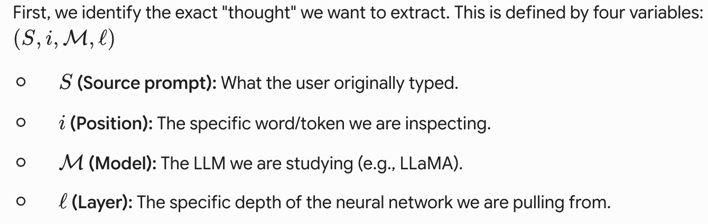
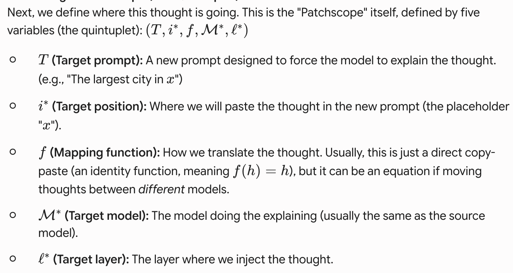

The papers studied in this batch: 

1. https://arxiv.org/pdf/2407.14435
2. https://transformer-circuits.pub/2025/introspection/index.html
3. https://arxiv.org/pdf/2401.06102

## Jumping Ahead: Improving Reconstruction Fidelity with JumpReLU Sparse Autoencoders

This is the main paper behind the JumpReLU style training of the Gemma Scope SAEs, which we know are simply a modification to the ReLU function, with a learned $\theta$ parameter. Since JumpReLU applies 0 to activations below the learned parameter, to backpropagate, we need STE (Straight Through Estimator).

> Q: Wouldn't a normal ReLU based NN also need STE since Relu also caps activations below 0?

> A: Plain ReLU: no STE needed. ReLU(x) = max($\theta$, x). Its gradient is $\theta$ for x < $\theta$, 1 for x > $\theta$, undefined only at the single point x=$\theta$ (measure zero, doesn't matter in practice — frameworks just pick $\theta$ or 1 there by convention). That gradient is exactly what you want: it tells upstream weights "you had no effect on this output" or "you had full linear effect." Standard backprop works fine. The kink location ($\theta$) is fixed, not learned, so there's no parameter whose gradient you need through the discontinuity itself. JumpReLU is different in one crucial way: $\theta$ is a learned parameter, not a fixed constant like $\theta$. The gating decision — "is this activation above $\theta$, yes/no" — is a step function of $\theta$. If you try to compute $\frac{\partial(output)}{\partial \theta}$, the true derivative of a step function is a Dirac delta: zero everywhere except exactly at the discontinuity, where it's infinite. That's not "annoying but survivable" the way ReLU's single non-differentiable point is — it's a signal that is genuinely zero almost everywhere. Gradient descent gets no information about which direction to move $\theta$. Same story for the raw L$\theta$ count (number of nonzero latents) — it's a step function of the pre-activation, and you want to differentiate through it to push the network toward sparsity.

## Replication Notes

- Pseudocode in Appendix J; kernel variants in Appendix H; training details Appendix I; MLP/attention plots Appendix G
- The main artifact of note here is Gemma Scope and SAELens, which holds hundreds of SAEs trained at every layer of the Gemma models
- This is the work that powers NeuronPedia
- OpenMoss and https://interp.open-moss.com/posts/complete-replacement

## Emergent Introspective Awareness in Large Language Models

This paper explores how well LLMs can introspectively notice "what is going on inside" their "minds". This is measured by injecting concepts into the residual stream, and the tested models are able to determine what the concepts are before they surface in their outputs, meaning, simple injection into the residual stream (AKA almost their thinking/mental state) is enough to determine that. The concepts are added are words as activation vectors, but the entire thing is also rated by another LLM acting as a judge.

There is a multi-prong measurement that the authors follow, which I like. These experiments were actually highly unreliable, so the results must be taken with a grain of salt.The concepts themselves were actually taken OOD (out of distribution), and the behavior in natural conditions is unnclear; it's strange why this was what the authors did. It would seem to me to be highly important to compare behaviors of the models in both cases...

- No official repo released, but the appendix does contain what sorts of injection words were used, and these can be helpful while designing experiments in the future
- Third-party replications with code (useful for extension): "Mechanisms of Introspective Awareness" (arXiv:2603.21396) releases code at github.com/safety-research/introspection-mechanisms and reuses Lindsey's original 50 concepts; another replication (arXiv:2512.12411) at github.com/elyhahami18/CS2881-Introspection reproduces the ~20% result on Llama-3.1-8B-Instruct and took the "simple dataset" directly from Anthropic's appendix; Pearson-Vogel et al. (arXiv:2602.20031) replicate on Qwen2.5-Coder-32B via cached representations and logit-lens.

## Patchscopes: A Unifying Framework for Inspecting Hidden Representations of Language Models

Patchscopes is a clever trick: it takes a "hidden thought" from the middle of the model's process and patches it into a completely new, specially designed prompt. This new prompt tricks the model into translating that hidden, complex math into plain English for us to read.

The paper uses a specific mathematical framework to formalize this "copy-paste" process. You have two main parts: the Source (where the thought comes from) and the Target (where the thought is going). 

1. The Source Representation: 
2. The Target Patchscope (The Quintuplet): 

The math simply states that when the target model $\mathcal{M}^*$ is reading the target prompt $T$, we forcibly overwrite its normal data $\bar{h}$ at position $(\ell^*, i^*)$ with our translated source data $f(h)$.

The researchers ran five main tests to prove that plugging thoughts into new prompts is better than older interpretability methods:

Next-Token Decoding: Can we figure out what word the model is about to say? Yes. Patchscopes beat older methods hands-down in the middle-to-late layers (layers 10 through 22).

Attribute Extraction: Can we pull pure facts out of the model's head? They pasted hidden thoughts into prompts like "The CEO is [x]" to see if the model would spit out the right name. It worked incredibly well without needing any extra training, beating older "probing" methods.

Entity Resolution: How fast does an LLM figure out who someone is? By pasting thoughts layer by layer into a prompt asking for a description, they watched the model figure out "Diana, Princess of Wales"—starting with "Wales," then realizing it's a "title," and finally realizing it's "Princess Diana" by layer 6.

Cross-Model Translation: They successfully took a thought from a small model (7B parameters) and pasted it into a bigger model (13B parameters) to have the smarter model explain what the smaller one was thinking.

Fixing Multi-Hop Reasoning: Sometimes models know Fact A and Fact B, but fail to connect them. By manually routing the hidden answer of Fact A directly into the prompt for Fact B, Patchscopes helped the model connect the dots, boosting accuracy from 19.5% to 50%.

## Limitations

The paper is honest that this isn't magic. There are some limitations:

Late Layer Degradation: If you try to extract facts from the very last layers of the model, Patchscopes fails. By the end of the network, the model stops caring about "facts" and only cares about formatting the exact next word it needs to print.

The Placeholder Leak: When they use a placeholder token like "x" in the target prompt, sometimes the model gets confused by the literal letter "x" instead of the data pasted over it.

It's a Lab Tool, Not a Product Feature: The multi-hop reasoning fix is just a proof-of-concept. It requires humans to know exactly where to patch the data, so it isn't an automated way to make AI smarter right now.

- Try it out for yourself! https://github.com/PAIR-code/interpretability/tree/master/patchscopes
- Mini-site + interactive explorable: https://pair-code.github.io/interpretability/patchscopes/ and the PAIR explorable "Can Large Language Models Explain Their Internal Mechanisms?" at https://pair.withgoogle.com/explorables/patchscopes/.
- Data: Attribute/multi-hop tasks build on Hernandez et al. (2023b) LRE data; entity-resolution uses PopQA; next-token uses the Pile.