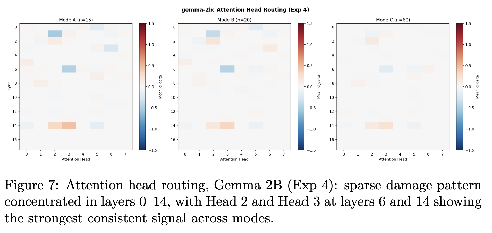
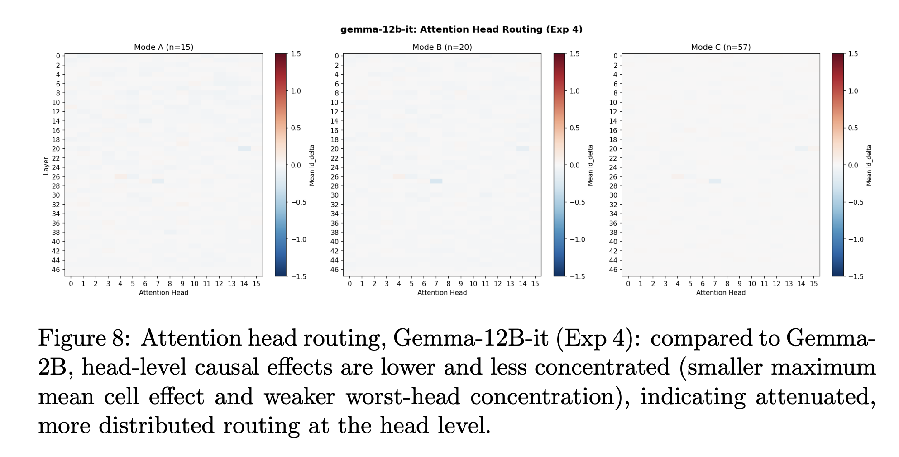
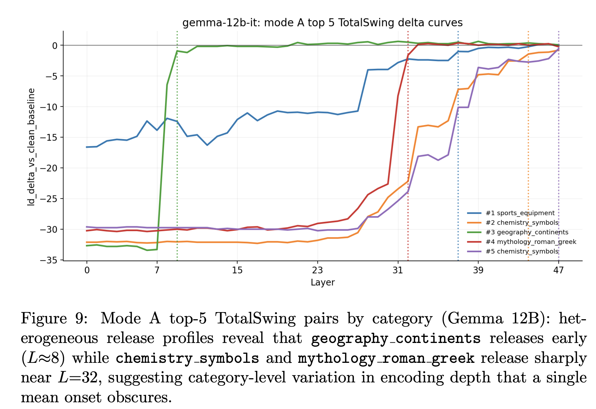

# BizzaroWorld, complete replication and findings on Gemma2B and Gemma12B-IT

In the initial post, I had just finished experimenting with Gemma2B and had discovered a three phase circuit for "fact-finding"
by localizing what the internal transformer model did one step at a time.

1. First, I designed a battery of 60 clean/corrupt pairs
2. Second, I did an initial triage into the prompts to find high signal ones by using a bidrectional **TotalSwing** metric
3. I designed three modes of experimentation (A, B, and C) to be run at every experimental stage to carefully monitor if it would change anything about the results seen[^1]
4. Using this, I did a final token patch, followed by sublayers decomposition (residual stream, attention heads, MLP layer)

[^1]: it did not. Across all experimental modes, the results were consistent, giving me confidence as an experimenter that the results and their interpretations were valid

The core finding was a three-phase factual recall circuit:

- **Phase 1 - Storage (layers 0-14[^2], entity token position):** 
  Facts are encoded as directions in the residual stream at the 
  entity token. The residual stream dominated causally here, 
  contributing 40× more than attention outputs and 18× more 
  than MLP outputs. 86.7% of top-15 prompt pairs released their 
  stored signal at layers 13-15, with a mean worst layer of 16.3 
  across all experimental modes (Pearson r = -0.83 between model 
  confidence and damage score).

- **Phase 2 - Routing (distributed attention heads):** Signal 
  moves from the entity token position to the final prediction 
  position via attention heads collectively. No single head was 
  sufficient — Head 2 was most consistent at 40% of prompt pairs 
  across Mode A, but individual head damage (max ΔLD = -0.68) was 
  negligible compared to full entity damage (ΔLD = -11.47).

- **Phase 3 - Readout (layers 15-17, final token position):** 
  The answer is retrieved, not computed. Late blocks are 
  pass-through — the signal is already encoded, simply being 
  read out. This was unanimous across all three experimental 
  modes and all 20 knowledge categories.

[^2]: The three-phase structure held — Storage, Routing, and Readout, with the handoff point scaling proportionally from layer 15 
in the 2B model to approximately layer 27 in the 12B model.

Now, I will summarize what I have discovered since then after replicating this entire suite of testing on Gemma-12B-IT, and my mini-experiments cross-architecturally, as there are some findings worth talking about, even though I did not
manage to run everything through LLaMa-70B, although attempts were made. The reasons behind this will be labelled below as well.

## Factual recall in Gemma-12B-IT

The results were consistent in this larger model, although they were scaled up as expected.

| Model | n_layers | # Attention Heads |
|---|---|---|
| Gemma-2B | 18 | 8 |
| Gemma-12B-IT | 48 | 16 |

When we patched to the entity token in Gemma 2B, we had found that there's a sharp increase in logit differences between clean and corrupt prompt pairs around layers 13-15, and I had hypothesized that routing is occuring around this point i.e.
the model is carrying information regarding the tokens at the entity poisition until there, and then it passes whatever it has learnt to components downstream at that point. This result was scaled up in the Gemma-12B-IT model to be around layers 
26-27 instead. Besides this expected scaling, most other findings were consistent, yet scaled up.

> One notable difference was that the effect of the attention heads was even less pronounced in Gemma-12B-IT, as the diagrams below show.

### 3.3 Head routing: 2B vs 12B

I had seen that different categories of facts behave differently in Gemma-2B, and this was further validated in Gemma-12B-IT. For instance, this graph shows how 5 different categories of facts. *For the experiments, I had designed 20 general categories of facts, ranging from geography to animals, as described below*.

## Tokenizer differences and their implications

It is known that tokenizers behave different across LLM architectures. This was to be expected, but what I did not expect was that even within the Gemma series of models, which is known to use the SentencePiece tokenizer, there are differences in how they map tokens to token ID arrays. For instance, 3 "golden pairs" were removed while running the pipeline through Gemma-12B-IT as compared to the smaller version of the model.

This was even more pronounced when I did initial experimentations with an 8-bit quantized version of LLaMa-70B through the fact battery. 22 golden prompt pairs were removed due to this behavior.

> The implication is that cross-model mechanistic comparisons are partly constrained by tokenizer-induced dataset drift, and reported differences should be interpreted with that caveat in mind.

## Why I couldn't test fully on LLaMa-70B (and other observations)

My initial plans were to use path patching and CMAP as described by Prakash et al.[^3] to take the activation patching done in BizzaroWorld further. The goal was to see if this was replicated in different model architectures, such as quantized versions of other models like LLaMa or deepseek or diffusion models. But there was a significant 30GB disk constraint on the HPC I was using, so I was forced to shelve this idea and stick to the Gemma family. But, in my opinion, it would be interesting to see if the ideas for fact-finding would hold across different models.

Fine-tuned variants with QLoRA could be experimented with as well.

## Why to even do this?

So far, whatever I have found is interesting, and these findings establish a foundation for targeted intervention: knowing where factual recall lives is prerequisite to knowing where to intervene when it fails.

To take these ideas further, I would like to follow through on my initial plans, and also see how the attention heads collaborate using SAEs. Yes, the residual stream is doing the heavy lifting, but what does that mean? I need further details. 

In summary, this study is constrained to the Gemma model family due to HPC disk quota limitations. Cross-architecture replication on LLaMA and other variants remains future work. Additionally, the distributed routing finding in Experiment 4 warrants path patching experiments to establish directed causal relationships between components.

[^3]: Nikhil Prakash, Tamar Rott Shaham, Tal Haklay, Yonatan Belinkov, and
David Bau. Fine-tuning enhances existing mechanisms: A case study on
entity tracking, 2024