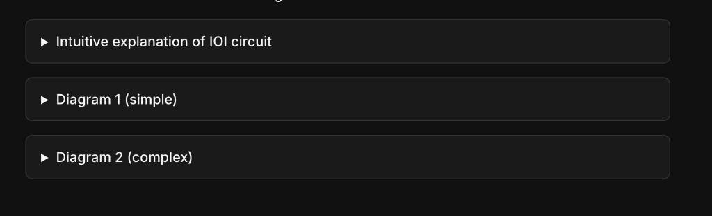
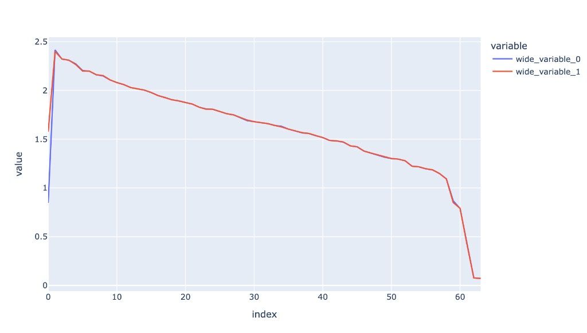
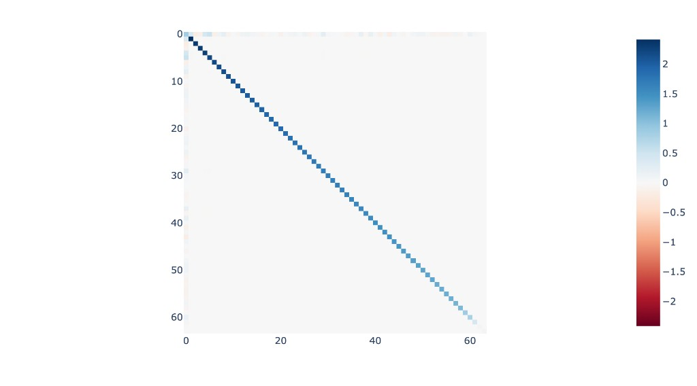

## [1.4.1] Indirect Object Identification (IOI)

- Chapter: `https://learn.arena.education/chapter1_transformer_interp/21_ioi/intro/`

### Notes

Setup is on Google Colab, at the top of every working notebook (because I will have one notebook per chapter, I will need to run this)

from google.colab import drive
drive.mount('/content/drive')
import os, sys
os.chdir('/content/drive/MyDrive/ARENA/ARENA_3.0')
sys.path.append('/content/drive/MyDrive/ARENA/ARENA_3.0')

And then start the session, so I will always be running and modifying code in the same directory.


## Interpretability in the wild

This paper is really seminal it seems. https://arxiv.org/abs/2211.00593. Multiple times mentioned in the Northeastern University paper, and this chapter will replicate exactly this. 

The model used in the paper is GPT-2 small. This chapter will give a high level overview, and the IOI part is the most technically dense, which I am excited about. That's exactly where I will find methodology to replicate this on BizzaroWorld. 

> Tip: Use torch.cuda.empty_cache() if you git CUDA memory errors

These guys are extremely organized, hats off to ARENA for making it so easy and effective for us new learners. The difficulty and importance ratings are useful, albeit not needed. Just like Michael Jordan, the aim is to focus on the little things. Little things lead to big things, where big things means the big understanding I aim to develop. So I will be doing everything, no doubt about it. Perhaps several times, if one time doesn't click. Alex Hormozi -> Do so much value, that it would be impossible for you to fail. 

Yet, I will not ignore the difficulty ratings. They will serve as signals for where to slow down and sit longer. High difficulty rating means more time time spent there. I will take care to spend more time that other sections, in a measured way, perhaps 5 hours more, as a loose heuristic

## The IOI Task (Indirect Object Identification)

Kevin Wang's paper for interpretability in the wild, what did it do? 

In the paper they rigorously reverse engineer a 26 head circuit, with 7 separate categories of heads used to perform this capability. The circuit they found roughly breaks down into three parts:

1. Identify what names are in the sentence
2. Identify which names are duplicated
3. Predict the name that is not duplicated

A video walkthrough of the paper by Neel Nanda with Wang -

[Part 1](https://www.youtube.com/watch?v=gzwj0jWbvbo) and
[Part 2](https://www.youtube.com/watch?v=b9xfYBKIaX4)

The tasks were chosen this way because they're common grammatical structures that earlier layers learn, easy to measure, and it's a well defined task. 



Check these resources after reading the chapter! 

Path patching is the more refined and technically intensive way of going about it, compared to activation patching. 

And finally, we'll do full replication too, by recovering the minimum circuitry through which we can recover original performance. Let's use GitHub because the website actually cuts off at a certain point. 


## Architecture

GPT2-small is a 12 layer, 80M parameter model. 12 attention heads per block and d_model hidden dimension = 768, so each head gets 64 dimensions

What are the parameters in the model loading functions?

HookedTransformer.from_pretrained()


**refactor_factored_attn_matrices**=redefining w_q, w_k, w_o, w_v in the model without changing model behavior

We know that the only matrix computation occurring within is $W_QW_k^T$. And then we do the singular value decomposition, as a reminder, this is a fundamental matrix factorization technique in linear algebra that decomposes any $m x n$ matrix 
into three specific matrices: $W_QW_k^T = U\Sigma V^T$

> Transpose is its own inverse — applying it twice returns the original matrix. So if A.T = B, transposing both sides gives (A.T).T = B.T, which simplifies to A = B.T. Valid.

So we can write equations for the matrices individually!

> $W_q = U \sqrt \Sigma$ 

> $W_k = V \sqrt \Sigma$

This means that $W_q$ and $W_k$
 both have orthogonal columns with matching norms i.e. each column of $W_q$ has the same length (L2 norm) as the corresponding column of $W_k$. 
 
 So column 1 of $W_q$ and column 1 of $W_k$ have the same magnitude, column 2 matches column 2, and so on.

It doesn't mean all columns have the same norm as each other — just that the pairing between those columns is norm-matched.





What this all means is WQ and WK are structured so their columns are orthogonal to each other and norm-matched across the two matrices. This is not random — it's a learned structure that makes the attention computation clean and interpretable. The model has essentially learned to use each column as an independent "direction" in representation space with no cross-contamination between directions.

In a similar way, since $W_{ov} = w_o w_v = U \Sigma V^T$, we can define $w_o = V^T$ and $w_v = U \Sigma$, slightly different to the above equation because: 

For QK: The attention score computation is a dot product between two projected vectors. The transpose appears naturally because you're measuring similarity between a query and a key, which requires one of them to be transposed to make the matrix multiplication work out dimensionally. 

For OV: The value-output computation is the application of two transformations sequentially to the same vector, just passing it through. There's no dot product, no similarity measurement, no transpose needed. You're just composing two linear maps. So $w_v w_o$ decomposes cleanly without a transpose.

QK is about comparison — query meets key, and comparison requires a transpose to align dimensions for the dot product.

OV is about transformation — value gets projected, then output projects it again. Pure sequential transformation, no comparison, no transpose.So, $W_{ov}$ is a pure rotation. 

```
utils.test_prompt(example_prompt, example_answer, model, prepend_bos=True)
```

is a useful function to test prompts with specific models and tokenizers! 

**Useful** -> We can prepend the beginning 
of sentence (BOS) because of tokenizer anomalies which I saw while experimenting with BizzaroWorld.

## Tokenization

Different names will be different numbers of tokens, different prompts will have the relevant tokens at different positions, different prompts will have different total numbers of tokens, etc. 

Language models often devote significant amounts of parameters in early layers to convert inputs from tokens to a more sensible internal format (and do the reverse in later layers). 

You really, really want to avoid needing to think about tokenization wherever possible when doing exploratory analysis (though, of course, it's relevant later when trying to flesh out your analysis and make it rigorous!). 

HookedTransformer comes with several helper methods to deal with tokens: **to_tokens, to_string, *to_str_tokens*, to_single_token, get_token_position**

> The outputs in this exercise were created by rich, a fun library which prints things in nice formats. It has functions like rich.table.Table, which are very easy to use but can produce visually clear outputs which are sometimes useful.

You can also color the columns of a table, by using the rich.table.Column argument with the style parameter. 

Anytime you do anything with TransformerLens, always use **run_with_cache**, so you can reuse the cahced internal activations later down the line. 

Our metric here will be the logit difference, the difference in logit between the indirect object's name and the subject's name (eg, logit(Mary) - logit(John)).

- Exercise: Spend some time thinking through how you might imagine this behaviour being implemented in a transformer. Try to think through this for yourself before reading through my thoughts!

Not sure... At a really high level, we have a bunch of prompts and we're measuring logit differences on how well the entity is being tracked here, which it is doing very well. 

As the tokens pass through the transformer, it goes through parallel heads in all 12 transformer blocks and 768 d_model so each attention head gets 64 dimensions. So per layers, all 12 blocks work in parallel, constrained by what happens layer wise. 

After attention is the MLP layer which the outputs of the attention heads are packed into W_O, concatenated and sent into the MLP. 

Somehow, someway, the model learns to recognize the entities. That's all I have so far.

### At a lower level

Think about what attention heads are good at — they move information from one token position to another. So the circuit probably needs at minimum:

A duplicate token head — somewhere early, a head learns to identify when the same name appears twice. It attends from the second occurrence of a name back to the first, flagging "I've seen this before."

An induction-style head — tracks the pattern of who did what to whom. Attends from the current position back to relevant subject positions.

An inhibition head — suppresses the name that was the subject of the previous clause. This is the key move — it's not just finding the right answer, it's actively penalizing the wrong one.

The model doesn't need to "understand" the sentence. It just needs to learn a set of attention patterns that implement the right information routing. The logit difference we're measuring is the end result of that routing — information about the indirect object getting amplified at the final position, information about the subject getting suppressed.

### Callum's Explanation

Prompt example: "When John and Mary went to the shops, John gave the bag to" -> " Mary".

Attention is really good at the primitive operations of looking nearby, or copying information. I can believe a tiny model could figure out that, at "to", it should look for names and predict that those names came next (e.g. the skip trigram " John...to -> John"). 

But it's much harder to tell how many of each previous name there are - attending to each copy of John will look exactly the same as attending to a single John token. So this will be pretty hard to figure out on the " to" token!

The natural place to break this symmetry is on the second " John" token - telling whether there is an earlier copy of the current token should be a much easier task. So I might expect there to be a head which detects duplicate tokens on the second " John" token, and then another head which moves that information from the second " John token to the " to" token.

The model then needs to learn to predict " Mary" and not " John". I can see two natural ways to do this:

1. Detect all preceding names and move this information to " to" and then delete the any name corresponding to the duplicate token feature. This feels easier done with a non-linearity, since precisely cancelling out vectors is hard, so I'd imagine an MLP layer deletes the " John" direction of the residual stream.

2. Have a head which attends to all previous names, but where the duplicate token features inhibit it from attending to specific names. So this only attends to Mary. And then the output of this head maps to the logits.

From these hypotheses, the second one is correct. A test that could distinguish these two is to look at which components of the model add directly to the logits - if it's mostly attention heads which attend to " Mary" and to neither " John" it's probably hypothesis 2, if it's mostly MLPs it's probably hypothesis 1.

> TLDR ~ if the heads are specifically routing Mary's information to the final position while ignoring John, that supports hypothesis 2 — the model is directly promoting the indirect object.

## Logit Attribution

Logit difference and attribution is a great way to work within interpretability because the computations in a transformer can be broken into individual contributions by specific parts. The logits of a model are logits=Unembed(LayerNorm(final_residual_stream)). The Unembed is a linear map, and LayerNorm is approximately a linear map, so we can decompose the logits into the sum of the contributions of each component, and look at which components contribute the most to the logit of the correct token! This is called direct logit attribution. 

Two ways to analyze model outputs i.e. through logits or output log probabilities. As a reminder, the LLM training process is an inherently classification problem with a softmax at the end. It's doing next word prediction over and over again, over the entire vocabulary. So, the loss function used it cross entropy loss. 

This is the elegant math which showcases why logits are a good metric to use! 

log_probs == logits.log_softmax(dim=-1) == logits - logsumexp(logits)

Why is this? Let's revist some ML. For the vector at position i,

- softmax(z)_i = $\frac{exp(z_i)}{\Sigma_j exp(z_j)}$

So softmax(z)_i answers: what fraction of the total exponential mass belongs to position i?

- Take the log of that
$log(softmax(z)_i) = log(exp(z_i) - log(\Sigma_j exp(z_j))$

- Log and exp cancel: 

$log(softmax(z)_i) = z_i - log(\Sigma_j exp(z_j))$

So, that's the logits - logsumexp(logits)

So cross-entropy becomes:

> loss = -log_prob(correct token) = -(z_k - logsumexp(z)) = logsumexp(z) - z_k

And the logits across vectors differ by a constant, 

log_probs(" Mary") - log_probs(" John") ->
<br><br>= [logits("Mary") - logsumexp(logits)] - [logits("John") - logsumexp(logits)]

<br>= logits("Mary") - logsumexp(logits) - logits("John") + logsumexp(logits)

<br>= logits("Mary") - logits("John")

### What about LayerNorm??

LayerNorm is similar to batch norm, which is a technique in deep learning to stablize the learning of models while making it faster. At each layer, the inputs will have 0 mean and S.D of 1. 

So, what's the difference between both?

Batch norm normalizes across the batches, as the name suggests. But, this is a problem for trnasformers because batch size matters. Small batches give noisy estimates of mean and variance. And at inference time with batch size 1, you have to use running statistics from training — which introduces a train/test discrepancy. Also sequence length varies across examples making it awkward.

LayerNorm — normalize across the features. For each example independently, compute mean and variance across all feature dimensions.

For example i at position t:

mean = average of x[i][t][j] across all j in d_model

var  = variance of x[i][t][j] across all j in d_model

normalized = (x[i][t][j] - mean) / sqrt(var + epsilon)

Each token's vector gets normalized using only its own statistics. No dependence on other examples in the batch, no dependence on batch size, no train/test discrepancy.

Why transformers use LayerNorm: each token's residual stream vector is normalized independently. Doesn't matter if batch size is 1 or 1000. 
Works cleanly at inference. Stable across variable sequence lengths.

TLDR -> BatchNorm normalizes each feature across examples. LayerNorm normalizes each example across features. Same math, different axis.

> Layer norm is almost a linear map, apart from the scaling step, because that divides by the norm of the vector and the norm is not a linear function. (The **fold_ln** flag when loading a model factors out all the linear parts)

> Getting an output logit is equivalent to projecting onto a direction in the residual stream, and the same is true for getting the logit diff.

### More calculations

Suppose our final value in the residual stream for a single sequence and a position within that sequence is x (i.e. x is a vector of length d_model). Then, ignoring layernorm, we get logits by multiplying by the unembedding matrix W_U (which has shape [d_model, d_vocab]):

output = xᵀ W_U

Now, remember that we want the logit diff, which is output_IO − output_S (the difference between the logits for our indirect object and subject). We can write this as:

$logit diff = (xᵀ W_U)_IO − (xᵀ W_U)_S = xᵀ (u_IO − u_S)$

That second part with $u_{IO}$ and $u_S is a bit of a jump but this is how it works.

W_U has shape [d_model, d_vocab]. So xᵀ W_U gives you a vector of length d_vocab — one logit per vocabulary token. 

When you index into that result with _IO, you're selecting one specific element. That element is the dot product of x with one specific column of W_U. Specifically the column corresponding to the IO token.

$(xᵀ W_U)_{IO} = x^Tu_{io} $

So...

$(xᵀ W_U)_{IO} − (xᵀ W_U)_S = x^Tu_{io} - x^Tu_{S}$

And then you take $x^t$ common. 

To be clear, W_U, the unembedding matrix, is learned during training, just like the rest of the matrices. 

And here's the cool part. Those values we just derived? It's callled the logit difference direction

$u_{io} - u_s $

In the field, the word projection is used, which means dot products of this kind. 
 


### Experimentation log

- torch.gather() lets you index into d_vocab using your answer token indices, pulling out exactly the two logit values you care about per batch item without looping.