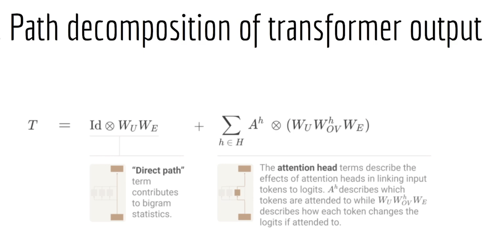

## Intro to Mechanistic Interpretability

Deep Dream, remember those crazy images you remember seeing around 2015? Yup, they basically did a kind of steering, amplifying the dog-like neurons on an image model. 

Two circuits that most LLMs seem to establish during training:

1. Skip triagrams
2. Induction heads

- Path deomposition of a transformer output? Think about skip connections. ResNet can be thought of as an ensemble of lots of different models. Not MoE. 

The residual stream in a transformer is literally a skip connection — the same mechanism ResNet introduced. At each layer, the block computes a delta and adds it to the existing stream. The output is the sum of all previous deltas plus the original embedding. So you can decompose the final output as:

output = embedding + Σ(attn_out_L) + Σ(mlp_out_L)  for L in 0..17

Every component's contribution is separable and additive. That's path decomposition 

— We're asking which paths through that additive sum contributed what to the final output. Transformer path decomposition works cleanly because of the additive residual structure. That additivity is what makes mechanistic interpretability tractable — you can isolate contributions. MoE breaks that tractability partially because the expert selection introduces input-dependent routing that's harder to decompose. One of the open problems in interpretability is how to apply circuit-style analysis to MoE models.

## Path decomposition

According to the picture, if we only take the direct path, the only thing the model can learn is bigram frequency statistics. A markovian AKA a markov model of language. The future state only depends on the present state, nothing else. A model that can only condition on the previous token. This is, of course, limited because human language has so much contextual richness which is nowhere near captured if all we have is the direct path.

The direct path in a transformer means the residual stream at each position flows straight through without any cross-token communication — no attention, no information from other positions. Each token's representation is updated only based on itself. That's exactly the Markov condition — each token only sees itself, not what came before it. This makes for a good baseline, actually. 

So, the high level steps in path patching must be: step by step, introduce one attention head at a time? Notice the differences in model output, compare against baseline. 

The heads that produce the biggest jumps when added are the load-bearing ones. The ones that produce no jump are irrelevant to this task. The minimal set that recovers baseline model performance is your circuit.

So the path through a transformer is the direct path (embedding and unembedding) and the indirect paths through the attention heads (embed O_v and unembed), summed together

The attention heads work in a smaller subspace because of the d_model dimension, which is 2048 for Gemma2B, so the total dimensionality of the residual stream is: [seq_len, d_model]. So the layers are reading and writing from different subspaces. The subspaces could overlap too, which would form a circuit which is precisely what we're after. 

The d_model is shared amongst attention heads, so each gets 2048/8=256 as the dimensionality. The key insight is that these subspaces are learned. Nothing forces Head 2 at layer 1 and Head 3 at layer 6 to operate in the same subspace. But if they do — if Head 2 writes information into a direction of the residual stream that Head 3's W_Q reads from — that's a circuit. Head 2 is talking to Head 3 through a shared subspace. Subspace alignment or intersection. That alignment is Q-composition or V-composition respectively.

We're also trying to find the smallest, most isolated subspaces here, which is where pruning and DCM comes in handy. 

Head A at layer 3 writes into the residual stream. Head B at layer 6 reads from that subspace and writes something back into the residual stream in a direction that overlaps with Head A's input subspace. But here's the constraint — Head A already ran at layer 3. It can't read what Head B wrote at layer 6 because layer 6 hasn't happened yet when layer 3 ran.

So the bidirectional relationship you're describing is possible but only across different layers:

Head A (layer 3) writes → residual stream
Head B (layer 6) reads from A's subspace, writes back into A's output subspace direction
Head A (layer 9) — if there's another instance — reads what B wrote

Within a single layer, true bidirectionality can't happen because all heads at that layer run in parallel on the same input residual stream. They can't read each other's outputs within the same layer.

So the answer is: yes, bidirectional subspace relationships exist across layers, but they're always temporally ordered. A can influence B which can influence a later instance of A's subspace. It looks like a cycle but it's actually a helix — spiraling forward through depth while looping back through subspace alignment.

Let's understand Q, K, V and the attention mechanism intuitively. If we think about an analogy. Imagine a line of people where they're passing messages to everyone behind the line. 

Query = what is the question being asked?
Key = Controls who replies
Value = What info gets sent back to the asker

MLPs is the internal processing done by each person, independent of everyone else, using whatever information they have, no communication done

## Skip trigrams and induction heads

**What a skip trigram actually is:**

A ... B C

Three tokens where A appeared earlier, then some gap, then B and C appear together. The pattern is: A was seen before, B just appeared, therefore C is likely next.

The example: "keep ... in mind"

A = "keep" (appeared earlier in the sequence)
B = "in" (current token)
C = "mind" (predicted next token)

The model learns: whenever I see "keep" somewhere earlier AND I'm currently at "in", the next word is very likely "mind."

This is a generalization of the induction head mechanism. Basic induction heads do: if A appeared before B last time, and I see A again, predict B. Skip trigrams extend this: if A appeared before, and I'm now at B, predict C — even if A and B weren't adjacent. The model is doing longer-range pattern completion.

**Note -> Remember that positional encodings are very important**

### An example

The setup

Sequence: keep ... in [?]
Positions: keep=1, [other tokens]=2,3,4, in=5, [?]=6
Simple model: 2 layers, 2 heads each.

> Layer 1, Head 1 — previous token head runs on ALL positions simultaneously

Remember attention runs on the entire sequence at once. So this head processes every token in parallel. At position 2 (whatever token follows keep): attends to position 1, writes "the token before me is keep" into position 2's residual stream. 

So after layer 1, position 5's residual stream contains "the token immediately before in is X", whatever token happened to be at position 4.

But here's the thing — keep is sitting at position 1 with information about itself just existing in its own residual stream. Nothing has moved keep's identity anywhere useful yet. It's just there.

> Layer 2, Head 1 — the induction head

Now this head runs on all positions simultaneously again. At position 5 (in), it asks: "what came immediately before me?" It reads position 5's residual stream and finds "X came before me." 

Now it searches backward through the entire sequence asking: "has there been any position earlier where X also appeared immediately before that position's token?"

First — its Query vector. This is computed from position 5's residual stream, which now contains (thanks to layer 1 head 1) the information "the token before me is Z." 

The Query encodes: I am looking for positions where Z appeared.

Second — the Key vectors at every other position. Each position's Key vector was also shaped by layer 1 head 1's work. Position 2's Key contains "the token before me was keep." Position 3's Key contains "the token before me was X." And so on.

The induction head computes dot products between position 5's Query and every other position's Key simultaneously. 

The attention score computation

The induction head computes dot products between position 5's Query and every other position's Key simultaneously.

score(pos5 query, pos1 key) = low    ← pos1 has no "before" info yet
score(pos5 query, pos2 key) = HIGH   ← pos2's key says "keep came before me"
score(pos5 query, pos3 key) = low    ← different token came before pos3
score(pos5 query, pos4 key) = low    ← different token came before pos4

Wait — why does pos2 score high? Because pos5's Query is saying "I want to find positions where X appeared before them" and pos2's Key is saying "keep appeared before me." If X equals keep — meaning keep is the token that appeared right before whatever precedes in — then the dot product is high.

But more precisely: the induction head learns to match "what came before the current token" in the Query against "what came before each past token" in the Keys. When those match, attention is high.

The attention mechanism computes dot products with all previous positions simultaneously. The positions that score high are the ones whose Keys match the Query. High attention weight → the Value at that position gets pulled forward into position 5's updated representation.

Some attention heads simply reserve the previous token, where it saw it, statistical information etc. Some are induction heads, which combine information from the residual stream incoming from past heads. Heads are not designed, they're discovered. 

## How you discover which head does what?

This is exactly what the ARENA IOI chapter teaches. The main technique is visualizing the attention pattern — the hook_pattern tensor of shape [batch, heads, query_pos, key_pos].

A previous token head looks like a diagonal stripe — each query position attending almost entirely to the position immediately before it.

An induction head looks like a diagonal stripe offset by some amount — each position attending to wherever the same token appeared before, then shifted forward by one.

A factual routing head — like what BizzaroWorld found with Head 2 — attends from the final token position back to the entity token position.

You literally plot the 8×8 or 18×8 attention matrices and look at the attention patterns.

Induction heads don't form for one layer transformers because of this sequential thing that attention heads do. If two things are in the same layer, they execute simultaneously and one thing cannot be conditional on the other

IOI = Indirect Object Identification. And yes — the IOI chapter is where path patching lives.