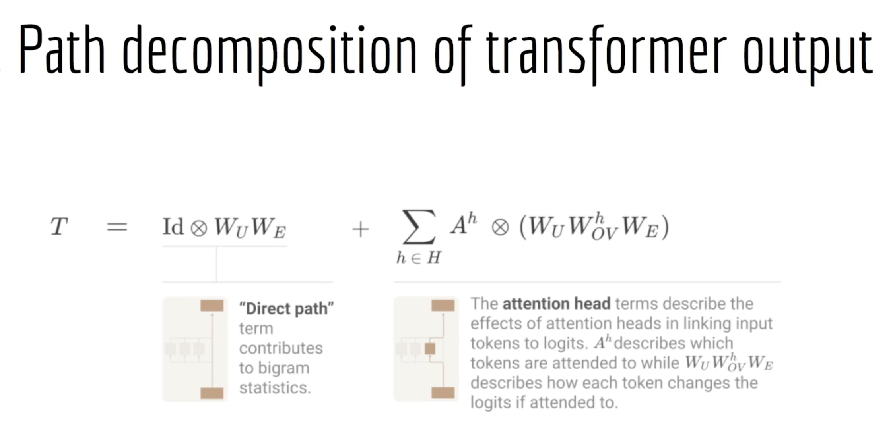
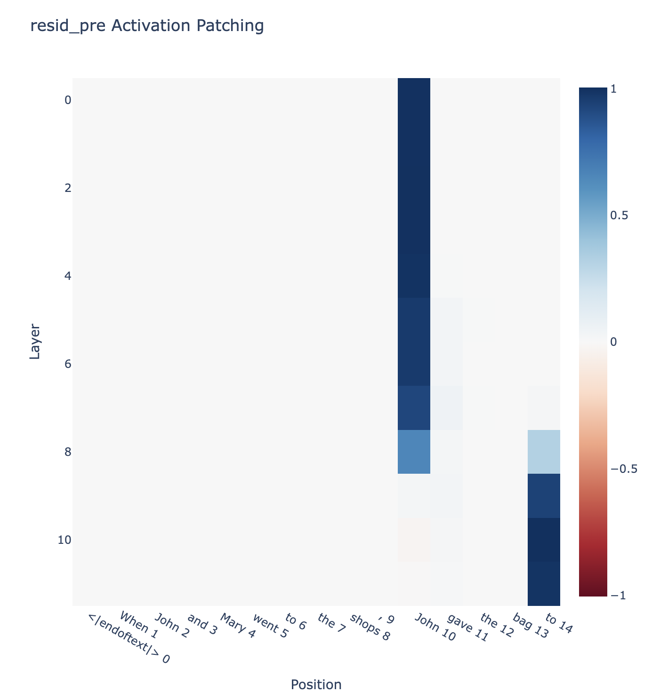
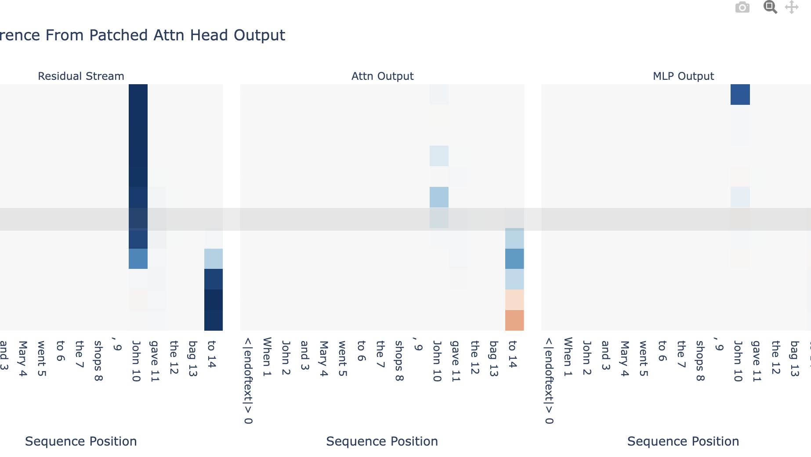
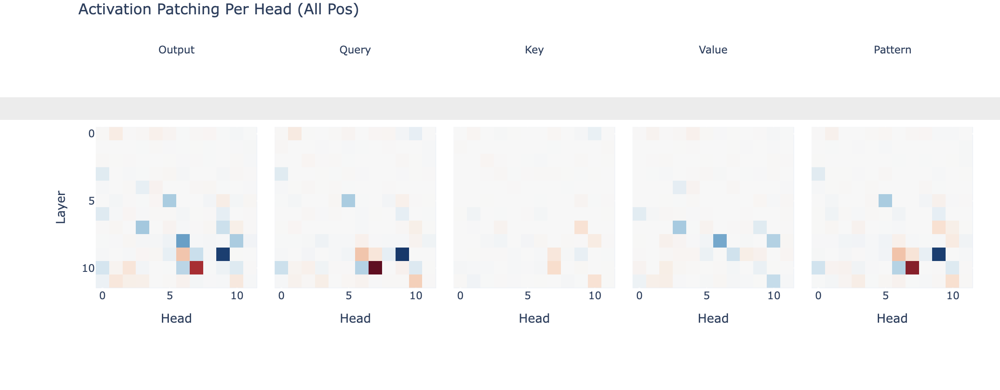

## Intro to Mechanistic Interpretability

Deep Dream, remember those crazy images you remember seeing around 2015? Yup, they basically did a kind of steering, amplifying the dog-like neurons on an image model. 

Two circuits that most LLMs seem to establish during training:

1. Skip triagrams
2. Induction heads

- Path deomposition of a transformer output? Think about skip connections. ResNet can be thought of as an ensemble of lots of different models. Not MoE. 

The residual stream in a transformer is literally a skip connection — the same mechanism ResNet introduced. At each layer, the block computes a delta and adds it to the existing stream. The output is the sum of all previous deltas plus the original embedding. So you can decompose the final output as:

output = embedding + Σ(attn_out_L) + Σ(mlp_out_L)  for L in 0..17

Every component's contribution is separable and additive. That's path decomposition 

— We're asking which paths through that additive sum contributed what to the final output. Transformer path decomposition works cleanly because of the additive residual structure. That additivity is what makes mechanistic interpretability tractable — you can isolate contributions. MoE breaks that tractability partially because the expert selection introduces input-dependent routing that's harder to decompose. One of the open problems in interpretability is how to apply circuit-style analysis to MoE models.

## Path decomposition



According to the picture, if we only take the direct path, the only thing the model can learn is bigram frequency statistics. A markovian AKA a markov model of language. The future state only depends on the present state, nothing else. A model that can only condition on the previous token. This is, of course, limited because human language has so much contextual richness which is nowhere near captured if all we have is the direct path.

The direct path in a transformer means the residual stream at each position flows straight through without any cross-token communication — no attention, no information from other positions. Each token's representation is updated only based on itself. That's exactly the Markov condition — each token only sees itself, not what came before it. This makes for a good baseline, actually. 

So, the high level steps in path patching must be: step by step, introduce one attention head at a time? Notice the differences in model output, compare against baseline. 

The heads that produce the biggest jumps when added are the load-bearing ones. The ones that produce no jump are irrelevant to this task. The minimal set that recovers baseline model performance is your circuit.

So the path through a transformer is the direct path (embedding and unembedding) and the indirect paths through the attention heads (embed O_v and unembed), summed together

The attention heads work in a smaller subspace because of the d_model dimension, which is 2048 for Gemma2B, so the total dimensionality of the residual stream is: [seq_len, d_model]. So the layers are reading and writing from different subspaces. The subspaces could overlap too, which would form a circuit which is precisely what we're after. 

The d_model is shared amongst attention heads, so each gets 2048/8=256 as the dimensionality. The key insight is that these subspaces are learned. Nothing forces Head 2 at layer 1 and Head 3 at layer 6 to operate in the same subspace. But if they do — if Head 2 writes information into a direction of the residual stream that Head 3's W_Q reads from — that's a circuit. Head 2 is talking to Head 3 through a shared subspace. Subspace alignment or intersection. That alignment is Q-composition or V-composition respectively.

We're also trying to find the smallest, most isolated subspaces here, which is where pruning and DCM comes in handy. 

Head A at layer 3 writes into the residual stream. Head B at layer 6 reads from that subspace and writes something back into the residual stream in a direction that overlaps with Head A's input subspace. But here's the constraint — Head A already ran at layer 3. It can't read what Head B wrote at layer 6 because layer 6 hasn't happened yet when layer 3 ran.

So the bidirectional relationship you're describing is possible but only across different layers:

Head A (layer 3) writes → residual stream
Head B (layer 6) reads from A's subspace, writes back into A's output subspace direction
Head A (layer 9) — if there's another instance — reads what B wrote

Within a single layer, true bidirectionality can't happen because all heads at that layer run in parallel on the same input residual stream. They can't read each other's outputs within the same layer.

So the answer is: yes, bidirectional subspace relationships exist across layers, but they're always temporally ordered. A can influence B which can influence a later instance of A's subspace. It looks like a cycle but it's actually a helix — spiraling forward through depth while looping back through subspace alignment.

Let's understand Q, K, V and the attention mechanism intuitively. If we think about an analogy. Imagine a line of people where they're passing messages to everyone behind the line. 

Query = what is the question being asked?
Key = Controls who replies
Value = What info gets sent back to the asker

MLPs is the internal processing done by each person, independent of everyone else, using whatever information they have, no communication done

## Skip trigrams and induction heads

**What a skip trigram actually is:**

A ... B C

Three tokens where A appeared earlier, then some gap, then B and C appear together. The pattern is: A was seen before, B just appeared, therefore C is likely next.

The example: "keep ... in mind"

A = "keep" (appeared earlier in the sequence)
B = "in" (current token)
C = "mind" (predicted next token)

The model learns: whenever I see "keep" somewhere earlier AND I'm currently at "in", the next word is very likely "mind."

This is a generalization of the induction head mechanism. Basic induction heads do: if A appeared before B last time, and I see A again, predict B. Skip trigrams extend this: if A appeared before, and I'm now at B, predict C — even if A and B weren't adjacent. The model is doing longer-range pattern completion.

**Note -> Remember that positional encodings are very important**

### An example

The setup

Sequence: keep ... in [?]
Positions: keep=1, [other tokens]=2,3,4, in=5, [?]=6
Simple model: 2 layers, 2 heads each.

> Layer 1, Head 1 — previous token head runs on ALL positions simultaneously

Remember attention runs on the entire sequence at once. So this head processes every token in parallel. At position 2 (whatever token follows keep): attends to position 1, writes "the token before me is keep" into position 2's residual stream. 

So after layer 1, position 5's residual stream contains "the token immediately before in is X", whatever token happened to be at position 4.

But here's the thing — keep is sitting at position 1 with information about itself just existing in its own residual stream. Nothing has moved keep's identity anywhere useful yet. It's just there.

> Layer 2, Head 1 — the induction head

Now this head runs on all positions simultaneously again. At position 5 (in), it asks: "what came immediately before me?" It reads position 5's residual stream and finds "X came before me." 

Now it searches backward through the entire sequence asking: "has there been any position earlier where X also appeared immediately before that position's token?"


First — its Query vector. This is computed from position 5's residual stream, which now contains (thanks to layer 1 head 1) the information "the token before me is Z." 

The Query encodes: I am looking for positions where Z appeared.

Second — the Key vectors at every other position. Each position's Key vector was also shaped by layer 1 head 1's work. Position 2's Key contains "the token before me was keep." Position 3's Key contains "the token before me was X." And so on.

The induction head computes dot products between position 5's Query and every other position's Key simultaneously. 

The attention score computation

The induction head computes dot products between position 5's Query and every other position's Key simultaneously.

score(pos5 query, pos1 key) = low    ← pos1 has no "before" info yet
score(pos5 query, pos2 key) = HIGH   ← pos2's key says "keep came before me"
score(pos5 query, pos3 key) = low    ← different token came before pos3
score(pos5 query, pos4 key) = low    ← different token came before pos4

Wait — why does pos2 score high? Because pos5's Query is saying "I want to find positions where X appeared before them" and pos2's Key is saying "keep appeared before me." If X equals keep — meaning keep is the token that appeared right before whatever precedes in — then the dot product is high.

But more precisely: the induction head learns to match "what came before the current token" in the Query against "what came before each past token" in the Keys. When those match, attention is high.

The attention mechanism computes dot products with all previous positions simultaneously. The positions that score high are the ones whose Keys match the Query. High attention weight → the Value at that position gets pulled forward into position 5's updated representation.

Some attention heads simply reserve the previous token, where it saw it, statistical information etc. Some are induction heads, which combine information from the residual stream incoming from past heads. Heads are not designed, they're discovered. 

## How you discover which head does what?

This is exactly what the ARENA IOI chapter teaches. The main technique is visualizing the attention pattern — the hook_pattern tensor of shape [batch, heads, query_pos, key_pos].

A previous token head looks like a diagonal stripe — each query position attending almost entirely to the position immediately before it.

An induction head looks like a diagonal stripe offset by some amount — each position attending to wherever the same token appeared before, then shifted forward by one.

A factual routing head — like what BizzaroWorld found with Head 2 — attends from the final token position back to the entity token position.

You literally plot the 8×8 or 18×8 attention matrices and look at the attention patterns.

Induction heads don't form for one layer transformers because of this sequential thing that attention heads do. If two things are in the same layer, they execute simultaneously and one thing cannot be conditional on the other

IOI = Indirect Object Identification. And yes — the IOI chapter is where path patching lives.


# Attention heads and residual stream patching

When we patch to every token position at the start of each layer, and write an HTML file using TransformerLens' patching module, this is what we get.



Question - what is the interpretation of this graph? What significant things does it tell you about the nature of how the model solves this task?

Around token positions (9-10), 14, and final, at layers 8, 8-final, and all the layers respectively (at different scales), activation patching is changing the behavior i.e. activation values of these tokens, which carry a causal signal about the task at hand. Yes, damage accrues aggressively towards the beginning for the S2 token i.e. the second "John" and then all damage is concentrated towards the final token position, starting at layers 8 onwards. Damage reaches its peak towards the end, with the thinking being that *routing* is occurring somewhere in between. Cool! Because this validates my findings in BizzaroWorld exactly.

TransformerLens works by defining hook points onto each component of the model, and this is what and why you can hook onto any bit, including the ResidualStream. The ActivationCache type component is accessible too but it has a different way by which you need to access it (cache[hook.name]), so you need the hook's name, the HookPoint object. 

## Patching in residual stream by block



This is experiment 2 of BizzaroWorld, where I'd used this. We want to see the logit differences and damage before and after the sublayers, to isolate relevant components. 

Here we see that the residual stream has a large, positive effect on the corrupt run for those very token positions we saw earlier. The attention output is also present ONLY at those layers, and MLP does minimal, except at only token position 9. 

> MLP layers specialize in information processing, so it makes sense that in experiments like these (and BizzaroWorld), its effects were extremely minimal.


MLP0 = first MLP sublayer of the first transformer layer, which seems to do something interesting and important, as we see on the graph above and as has been validated by other researchers too. But what? We can only talk hypothesis here it seems, but this is it:

> "It's often observed on GPT-2 Small that MLP0 matters a lot, and that ablating it utterly destroys performance. The current accepted hypothesis is that the first MLP layer is essentially acting as an extension of the embedding, and that when later layers want to access the input tokens they mostly read in the output of the first MLP layer, rather than the token embeddings. Within this frame, the first attention layer doesn't do much."

However, for this finding to hold true, the clean and corrupt pairs need to match such that ONLY at the target it differs. The author is arguing that only at that position, there's be a difference in extended embedding space, so If the token is identical AND the position is identical, the extended embedding is identical. Since all other positions have the same token at the same position, they have identical extended embeddings in both prompts.
S2 is the only exception, different token, therefore different embedding, therefore different input to every component at that position. 

My BizzaroWorld experiments weren't like that. The MLP0-at-S2 finding relies on a very specific property, that S2 is the ONLY position with a different extended embedding. If multiple positions differ between clean and corrupt, MLP0 shows signal at all of them, and the clean isolation of S2 disappears.

So, is it worthwhile to design prompts this clean or do it like we did in BizzaroWorld?

**BizzaroWorld approach:**

| Property | Detail |
|---|---|
| Prompt design | 60 pairs across 20 categories |
| Corruption type | Entity swap, variable context |
| Token diff | Multiple positions may differ |
| Selection | TotalSwing triage → golden pairs |
| Strength | Breadth, generalizability |
| Weakness | Less mechanistic precision |
| Best for | Finding circuits that exist broadly |

---

**ARENA/IOI approach:**

| Property | Detail |
|---|---|
| Prompt design | Single template, multiple name pairs |
| Corruption type | Single token swap at fixed position |
| Token diff | Exactly one position differs |
| Selection | Controlled by design |
| Strength | Mechanistic precision, clean attribution |
| Weakness | Narrow, may not generalize |
| Best for | Characterizing specific mechanisms precisely |

This behavior would seem to suggest that the geometric structure of the embedding and unembedding spaces should be related. 

To understand more, if we took out all the MLP and attention sublayers from the transformer, it would only calculate bigram statistics because that kind of entity would only calculate linear interactions between the embedding and unembedding matrices. The embedding and the unembedding together form the direct path (if we had no other components then the transformer would just be the linear map $x \rightarrow x^T W_E W_U$).

Think of W_E · W_U as a giant lookup table:

rows    = input tokens (what token am I?)
columns = output tokens (what token comes next?)
value   = logit (how likely is this next token?)

A lookup table with no context is the definition of a bigram model. The matrix multiplication is just an efficient way to implement that lookup table in continuous space.

Everything beyond bigrams, syntax, semantics, long-range dependencies, requires the attention heads and MLPs on top of this linear foundation.

In the next exercise, we edit the above function to accept hooks pre-attention heads, post, and also the same for the MLP sublayer, and there are some helpful functions to know what's the name that TransformerLens to communicate about these points.

1. TransformerLens docs
https://transformerlensorg.github.io/TransformerLens/ — has a full list of hook names.
2. utils.get_act_name helper
pythonutils.get_act_name("resid_pre", 0) i.e. blocks.0. hook_resid_pre

utils.get_act_name("attn_out", 3) i.e. blocks.3. hook_attn_out
utils.get_act_name("mlp_out", 7) i.e. blocks.7.hook_mlp_out
utils.get_act_name("z", 5) i.e. blocks.5.attn.hook_z

This is the cleanest way — you pass a short name and a layer number, it returns the full hook string.

3. Print all hooks directly from the model
pythonprint(model.hook_dict.keys())

## Head to head patching

So far we have patched in the residual stream at every token position, as well as before all the sublayer components. Now, we'll look at patching the output of individual attention heads rather than the full attention layer output.

### The attention head computation pipeline

To understand how to do this appropriately, let's understand what is actually happening.

Q, K, V computed from residual stream <br>&darr;<br>
Attention scores → softmax → attention pattern <br>&darr;<br>
       
Value vectors weighted by attention pattern → z  ← PATCH HERE <br>&darr;<br>
       
z × W_O  (projects from d_head → d_model) <br>&darr;<br>
       
Output added back to residual stream

d_head is the attention head parameter, d_model is the model parameter. So, we project from d_head onto d_model after the entire aggregated attention head, and we're saying, prior to the weighing by each attention head, we patch there, before the projections. So, each attention head's activity is nicely patched, since each of fully independent and parallel to each other, no sequentialism, so this can be done.

The key insight is that z lives in the space where heads are still structurally independent i.e. shape [batch, seq, n_heads, d_head]. Each head occupies its own slice along the n_heads dimension, so patching head 7 means you touch [:, :, 7, :] and nothing else moves.

One thing worth keeping in our minds as we move to path patching later: z patching tells you a head matters, but not why: you don't know if the head is moving information via its Q, K, or V computation. This is where path patching will be more insightful.

Hmm, layer 10, head 7 seems particularly prone to damage via patching. 


> Always use model.reset_hooks() on top of patching functions you write. TransformerLens hooks accumulate — if a previous run_with_hooks call crashed mid-loop or you manually added hooks somewhere, they can persist on the model object. reset_hooks() guarantees you start each experiment with a clean slate.

## Decomposing Heads

An attention head consists of two semi-independent operations - calculating where to move information from and to (represented by the attention pattern and implemented via the QK-circuit) and calculating what information to move (represented by the value vectors and implemented by the OV circuit).

A useful function for doing this is get_act_patch_attn_head_all_pos_every. Rather than just patching on head output (like the previous one), it patches on:

1. Output (this is equivalent to patching the value the head writes to the residual stream)
2. Queries (i.e. the patching the query vectors, without changing the key or value vectors)
3. Keys
4. Values
5. Patterns (i.e. the attention patterns).

Again, note that this function isn't patching multiple things at once. It's looping through each of these five, and getting the results from patching them one at a time.

**When we register hook_fn via fwd_hooks, TransformerLens calls it as: hook_fn(activation_tensor, hook_point_object)**

Since partial already bound head_index and clean_cache, those two positional slots are satisfied. TL just needs to supply the first two — the actual live activation tensor and the hook metadata object — which it does automatically during the forward pass.
So the flow is:

You freeze the "slow" arguments ahead of time with partial
TL supplies the "live" arguments at runtime — the actual tensor flowing through the model at that hook point
Combined, all four arguments are satisfied and the function executes

This is why partial is the standard pattern for TL hooks — you need the hook signature to be (tensor, hook) for TL to call it, but you also need to pass experiment-specific state like head_index. partial bridges that gap cleanly.

dtype=model.cfg.dtype, use this as a dtype whenever you define a tensor, because you know how important this parameter is. Using whatever dtype that the model uses, is a good heuristic to use, unless you are actively working with quantized tensors to save VRAM space.

The key insight from the plot — Output and Query are nearly identical, which makes mechanistic sense: patching z (output) vs patching q tells you whether the head matters via what it writes vs what it attends to. The fact that they match means the same heads are causally important regardless of which intervention you use — that's a robustness signal, not redundancy.

Key observation from your plot: Layer 9-10, heads 6-9 are the hot zone — dark blue (strongly positive, restoring clean behavior) and dark red (strongly negative, hurting performance). That cluster is almost certainly where the name mover heads and S-inhibition heads live, which is exactly what the IOI circuit paper identifies. We're about to reverse-engineer the same circuit Wang et al. found.

We need two different hook functions for attention pattern versus all the other 3 components: K, V, Q, and z. These latter ones are vectors with shape [batch, pos, head, d_head], but the pattern variable is a matrix [batch, head, pos_q, pos_k], where the matrix represents "how much does token at position q attend to token at position k, for each head." There's no d_head dimension because this is the attention weights — the softmax output — not a feature vector. Head is dim 1 here because the pattern is organized as a full [pos_q, pos_k] matrix per head. 

So conceptually:

Q, K, V, z answer: "what is this token's representation?"
Pattern answers: "what is this head's attention distribution across the full sequence?"

"We can do this in an even more fine-grained way; the function patching.get_act_patch_attn_head_by_pos_every (i.e. same as above but replacing all_pos with by_pos) will give you the same decomposition, but by sequence position as well as by layer, head and component." That is pretty incredibly detailed, I gain confidence by the dact that we can do at least this level with LLMs! These functions are really slow to run obviously given the number of forward passes we need to compile all the metrics returned by the functions.

When we patch the heads, this is the graph we see.



Consistency across components matters more than peak brightness in one

A head that lights up strongly in Output and Query and Pattern is more mechanistically interesting than one that's bright only in Output. It suggests the head is doing real computation — it's attending to the right things (Pattern), processing queries correctly (Query), and writing the right output (Output). That's a circuit, not a coincidence.

As a loose recommendation:

- Output + Query + Pattern active → head is doing full computation: finding the right token (Pattern), processing it (Query), writing it out (Output). Classic name mover signature.

- Output + Value only → head is a conduit, not a router. Information was already positioned correctly upstream.

- Output only, red → S-inhibition candidate. Actively suppressing something.

Earlier heads (3.0, 5.5, 6.9) — Query active, Pattern active, but Value silent

That's the striking thing. If a head matters because of its Query vector but not its Value vector, it means the head's importance comes from where it attends (the attention pattern it computes), not what it reads. The Query determines the pattern, so Query-active + Pattern-active + Value-silent = "this head's job is to route attention correctly, the content being moved doesn't matter much."

Query = "what am I looking for?" — encoded at the destination token

Key = "what do I contain?" — encoded at every source token

Value = "what do I actually hold?" — the content at every source token

Key = the index, optimized for matchability. It's designed to answer "do I have what you're looking for?" It never gets read for content — it only participates in the QK^T dot product to produce the attention weights. After that it's done.

Value = the actual content, optimized for informativeness. It's what gets aggregated and written into the residual stream. It never participates in deciding where to attend.

The crucial point — Key and Value are projections of the same source token but into different spaces for different purposes.

```
K = x @ W_K   # shaped to be matchable against queries
V = x @ W_V   # shaped to carry useful content forward
```

Why split them? Because what makes a good index is different from what makes good content. A token might have a very distinctive Key (easy to find) but a Value that encodes something completely different, like positional information, or a semantic feature that's useful downstream but wouldn't help with matching at all.

The attention pattern is just softmax(QK^T) — it's asking "how well does each source token's Key match my Query?" The result is a probability distribution over source positions — that's the where.

So Query determines where because the Query vector is the search vector. The token that needs information encodes what it's looking for into Q, broadcasts that against all Keys, and the dot product similarity decides which positions to attend to.

Middle heads (7.3, 7.9, 8.6, 8.10) — Value active, but Query and Pattern relatively quiet

The pattern these heads compute is already fine in the corrupted run. They're already attending to roughly the right positions even with corrupted tokens. The corruption didn't break their routing.

What IS broken is the Value — the content at the positions they're attending to changed because the corrupted prompt has different tokens there. So the head lands in the right place but reads corrupted content.


## Setup for experimentation

Area has two components. Instructions and exercises. I have cloned the repo to my Colab Drive space, and will be referring to that always. My workflow is: read the instructions chapter on learn.arena.education, and then do the associated exercises with the GPU inside the exercises directory, which is already an ipynb file, so it is nicely put together! B