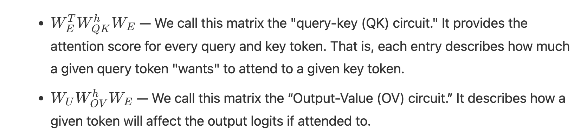
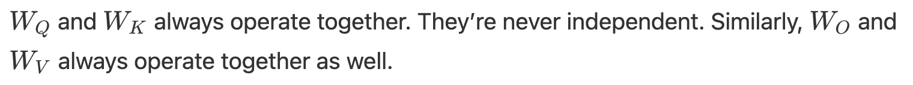

## A Mathematical Framework for Transformer Circuits

The entirety of the distill circuits thread is actually focused completely on vision models. This is the first attempt to do the same for transformers, which is exactly the criticism I'd had, re-reading the post. In this post, the authors look at attention-only transformers with <= 2 layers and ignored the LayerNorm component, due to the sheer compelxity of modern models. This post will introduce us to induction heads, which are mentioned a lot in the Kevin Wang paper too. 

A reminder: quite a lot can be understood about a transformer by pulling apart its linear operations.

Attention heads do two independent calculations. The QK circuit for the attention pattern "who to attend to" = "if". Which token positions get attended to, and how strongly. The output of QK is the attention pattern — a probability distribution over token positions. The OV circuit for which computes how each token affects the output if attended to i.e. QK decides the "if", OV decides the "what information gets moved once attention is decided". OV handles "what to do with the attended token". **Key point**: these two calculations are independent. QK doesn't know what OV will do with the result. OV doesn't know how QK chose what to attend to. They compose multiplicatively at runtime but are learned and interpretable as separate circuits.

Seems like further decomposition of the BizzaroWorld experimentation into QK and OV could be a nice addition, a future work section.
Path patching told me which heads matter. QK/OV decomposition tells me why they matter mechanistically — whether L38H8's dominance comes from it selecting the right token to attend to (QK), reading the right information from it (OV), or both.

Concretely for the L38H8 example from Gemma12B-IT:

QK analysis — does L38H8 selectively attend to the entity token position? Run the clean prompts, extract the attention pattern for L38H8, check whether attention weight is disproportionately concentrated on the entity token ("Tower", "Paris", "Einstein") vs other positions. If yes, the head knows where to look.

OV analysis — does W_OV map entity token embeddings toward their correct factual completions? Compute W_OV = W_V @ W_O for L38H8, apply it to the entity token's residual stream vector, project through W_U and check if the output points toward the correct answer token in vocabulary space. If yes, the head knows what to retrieve.

The interesting cases are:

Both QK and OV work correctly → complete factual retrieval head
QK selects right but OV is diffuse → routing head, not storage head
OV is sharp but QK attends broadly → lucky retrieval, not targeted
Neither → head contributes via a more indirect mechanism

For the paper, this is Future Work — one clean paragraph describing the decomposition as the next logical step, citing the Mathematical Framework paper for the QK/OV formalism. But it's also the experiment that would most directly answer "what algorithm is L38H8 implementing" — which is your "reading the algorithm off the weights" question from earlier, now made concrete and tractable for a single head rather than the whole model.

That's probably a third paper actually: BizzaroWorld (circuit identification) → SAE features (what information flows) → QK/OV decomposition (what algorithm the hub implements). Clean trilogy.

> THe authors mention that analyzing the MLP sublayer in the transformer is especially hard and is a weakness of their work as of 2021; interesting, and an attack vector for you to make dispropportionate impact if this trend has held so far into mid-2026.

## An Overview of the Transformer Architecture

Modern LLMs are decoder only, although the original transformer paper is encoder-decoder. The autoregressive LLMs I have taked a look at so far follow suit: Meta explicitly states that Llama 3 uses a standard decoder-only transformer architecture. Gemma 3 (12B and 27B) similarly uses a decoder-only architecture with global and local attention layers — the Gemma 3 technical report compares their local-global attention ratio against "global only, which is the standard used in Gemma 1 and Llama," confirming both are in the same decoder-only family. Gemma 2B (Gemma 1) is also decoder-only. 

The transformer begins by embedding the tokens, then the residual blocks (attention heads, MLP sublayers), and then the unembedding. All residual block components read and write into the residual stream by linear projections, which is takes a vector of size A and multiplies it by a matrix of size [A × B] to produce a vector of size B. You're transforming the vector into a different space, potentially changing its dimensionality. The output is still a vector, not a scalar. Every element of the output is a weighted sum (dot product) of the input vector with one row of the matrix — so it's many dot products happening in parallel, one per output dimension.

> As a reminder, the size of the residual stream is determined by d_model, the embedding matrix's size

Another experiment idea:

> Fix everything except d_model — same architecture depth, same training data, same number of training steps, same features in the dataset (you control what concepts exist). Train N variants with d_model = 2, 4, 8, 16, 32, 64, 128. For each variant, measure polysemanticity at the critical layer using your SAE entropy metric or participation ratio. Plot polysemanticity vs d_model. Find d*. Then the interesting question: what is special about d*? Is it related to the number of features in the training data? Is it related to the frequency distribution of features — does it matter whether features are equally common or Zipf-distributed? The Anthropic paper showed that feature frequency matters (rare features get superposed first) but didn't derive d* analytically. The Richard Feynman question that follows: can you predict d* before training, from first principles, knowing only the data distribution and the architecture? If yes, you have a theory. If no, you know what's missing from the theory.

The residual stream in transformers have no "priviledged basis", which means we could rotate it by rotating all the matrices interacting with it, without changing model behavior. If you take every matrix that reads from the residual stream (W_Q, W_K, W_V, W_in) and every matrix that writes to it (W_O, W_out, W_E, W_U) and multiply them all by the same rotation matrix R on the appropriate side, the model's input-output behavior is completely unchanged. If a layer computes W_read × residual_stream, and you rotate the residual stream by R, then W_read × (R × residual) = (W_read × R) × residual. So you just absorb R into W_read. Every matrix that touches the residual stream gets pre- or post-multiplied by R or R^T, and since R is orthogonal (R^T R = I), all the Rs cancel out end-to-end and the model produces identical outputs.

This is called rotational symmetry of the residual stream: the coordinate system of the residual stream is arbitrary. There's no reason dimension 42 "means" anything in particular — you could rotate the entire space and relabel all dimensions and the model would be identical.

The implication for interpretability is uncomfortable: when you look at a residual stream vector and say "dimension 42 has a high activation," that number is meaningless on its own — it depends entirely on which arbitrary rotation you happen to be using as your coordinate system. What's invariant isn't individual dimensions but geometric relationships between vectors — angles, dot products, subspaces. Which is exactly why reading features off individual neurons fails, and why SAEs look for directions rather than axes. 

> To understand this, an analogy. The point (2, 2) only means something because we have a defined coordinate system. (2, 2) could be represented as something else entirely if we projected it onto a different system, if we could find a similar rotation matrix. The Residual stream in transformers have that precise thing, so the activation is meaningless unless we also get the relationship between vectors in that space, which is why we need activation + direction, without direction it's like saying I am 5 6 without specifying a unit. 

Virtual weights is a fascinating concept. Because the residual stream and all computations in the transformer are linear operations (except something like SwiGLU in the MLP sublayers), we could represent computations between these layers through virtual weights. But remember that everything in the transformer is unidirectional: the residual stream flows in one direction only: layer 0 → layer 1 → layer 2 → ... → layer N. Each layer reads from the current state of the residual stream and writes back to it additively, but only forward. Layer 10 cannot send a signal back to layer 2 because by the time layer 10 runs, layer 2 has already finished executing and its output is baked into the residual stream. There's no backward pass during inference — that only exists during training as gradient flow, which is a completely separate thing.

Virtual weights — when you compose W_OV of layer 1 with W_QK of layer 3, that composition only makes sense in the L1→L3 direction. W_OV(L1) × W_QK(L3) is the meaningful composition, and it reads causally as: L1 writes something into the residual stream via its OV circuit, then L3 reads that contribution via its QK circuit. That's a valid forward-direction virtual weight that captures how L1's output influences what L3 attends to. Perfectly well-defined.

W_QK(L1) × W_OV(L3), on the other hand, has no causal interpretation — not because L3 can't run after L1 (it always does), but because that specific composition asks "what does L3's value/output projection do to L1's query/key computation" — which is backwards. L3's OV circuit runs after L1's QK circuit, so L3's output was never available when L1 was computing its attention pattern. The composition is mathematically valid as a matrix product but causally meaningless — it describes an interaction that never actually occurs in the forward pass.

Communication in the residual stream is limited by the space in the residual stream which is far lesser than what the transformer layers is trying to communicate to it, all at once. single highway with a fixed number of lanes that every driver (layer) has to share simultaneously. It is like a single highway with a fixed number of lanes that every driver (layer) has to share simultaneously. The highway doesn't get narrower as more cars use it — it's always d_model lanes wide — but the more information different layers are trying to transmit through it at the same time, the more they have to coordinate to avoid collisions. Superposition is what happens when two different "messages" have to share the same lane — they coexist but interfere with each other slightly. The bottleneck is not temporal (earlier layers crowding out later ones) but concurrent — at any given layer, the residual stream is carrying far more information than it has dimensions, because every prior layer has written into it simultaneously and those writes all coexist in the same d_model-dimensional vector. Layer 25 in a 50-layer transformer is trying to read from a residual stream that has accumulated contributions from 25 prior attention heads and 25 prior MLPs, all superposed into d_model dimensions. That's the bottleneck — not that space ran out, but that everything is talking at once through a channel too narrow for all the simultaneous conversations.

Some MLP neurons and attention heads take up a kind of memory management role, actively deleting prior information. Evidence of this: some MLP neurons having negative cosine similarity between its inputs and outputs or attention heads have negative eigenvalues (if the eigenvalue is positive, the matrix stretches that vector in the same direction. If it's negative, the matrix flips that vector to point in the opposite direction — it reverses it).

The full residual stream is [seq_len × d_model], soe each token has its own row. MLP layers, by contrast, operate entirely within a single token's row — they read from position i's residual stream vector and write back to position i's residual stream vector only, with no cross-token communication whatsoever.

There's a lot of independent as well as combined behavior here; worth pausing to appreciate the nuance. 

## N Layer Transformers

0-layer -> takes a token, embeds it, and then unembeds it. Predicting the next token from the current token, without having anything contextual about the rest of the prompt "in mind". Represents bigram statistics which aren’t described by more general grammatical rules, such as the fact that “Barack” is often followed by “Obama”.

1-layer -> embedding, one attention layer, and unembedding. This is functionally equivalent to an ensemble of the bigram model with some skip-trigrams.

Even here, the outputs, while it has been linearly broken down, are enormous. If the vocabulary is ~50,000 tokens, a single expanded OV matrix has ~2.5 billion entries. 

Skip-trigrams, although simple, can encode pretty complex behavior. They're able to detect common patterns in language and coding, such as the likelihood of the next token being else: if the previous one is if and there is a tab; or \left commands being used with \right in LaTeX; or English phrases like "in" -> "mind", "in" -> "fact", "at" -> "bay", etc. Sometimes skip-trigrams make no sense, but that's because you probably lack the world knowledge (example, Israel … K → nes refers to Israel's legislative body i.e. "Knesset").

Copying behavior is widespread in OV matrices, where some attention heads are dedicated solely to copying relevent tokens to certain places in the residual stream to be used by other heads at some point. Copying behavior involves increasing the probability of the current token; by eigendecomposition, we can break down the OV matrix, and we know that the eigenvalues can be positive or negative. But copying behavior requires positive eigenvalues, and this is exactly what is observed in some attention heads, so we can call them "copying heads". A significant chunk of attention heads seem to have positive eigenvalues, so we don't want to casually assume ALL OF THEM are copying heads (but some likely are).

## Where does deep learning get its power from?

Once we get to 2-layer transformers, something different starts happening. Composition, this is the source of deep learning's powers, because at this point, we have broken down the matrices into components and we know that, if nothing different happens, the models would only get better at skip-trigrams. **But this is not what happens.** We start seeing new model behavior and attention heads called induction heads, as compared to previous token heads.

> **Previous token head**: attends to the token immediately before the current position. If you're at position 5, it attends to position 4. Simple, local, one-step lookback. The QK circuit is essentially implementing "attend to position i-1 when processing position i" — a fixed relative position bias. What it writes via OV is the representation of that previous token into the current position's residual stream. It's a short-range information mover with no pattern-matching involved.
> 
> **Induction head**: does something more sophisticated — it looks for a pattern in the past sequence and completes it. Specifically: if the sequence contains [A][B]...[A], an induction head at the second [A] attends back to the first [B] (the token that followed the first [A]) and predicts that [B] will come again. It's implementing "find the previous occurrence of the current token, then attend to what came after it."
>
> Crucially, induction heads are a two-head circuit, not a single head. They require a previous token head in an earlier layer to set them up. The previous token head writes "what came before me" into each token's residual stream. Then the induction head in a later layer uses that information in its QK circuit: it matches the current token's query against keys that contain "what came before this token" — finding positions where the preceding context matches the current token. That's how it locates the right position to attend to.
>
> So the relationship is: previous token head is a primitive building block, induction head is a higher-order circuit built on top of it. Previous token head = one-step memory. Induction head = pattern completion using that one-step memory as a lookup key. The composition of the two across layers is one of the cleanest examples of circuits building on circuits in transformers — and the reason the Mathematical Framework paper treats it as the canonical demonstration that multi-layer circuits are real and mechanistically interpretable.

Attention heads themselves work in a d_head space, which is d_model divided equally by the number of attention heads, so they should avoid interaction. While this is the case, we also noted above that there's a limit to the space in the residual stream, which could be one of the hypotheses for why polysemanticity occurs; however, these two seemingly contradicting viewpoints can be resolved. 

**Why the residual stream is still a bottleneck**: the constraint isn't heads vs heads — it's the total number of things trying to communicate through d_model dimensions simultaneously. You have seq_len tokens each with their own d_model vector, but within each token's vector you have contributions from every prior attention head and every prior MLP layer all superposed together. At layer 25 of a 50-layer model, 25 attention sublayers and 25 MLP sublayers have all written into that same d_model-wide vector. The MLP intermediate size alone is 4×d_model per layer, meaning each MLP layer computed in a space 4x wider than the residual stream and then compressed back down. All that information is trying to coexist in d_model dimensions simultaneously.
So the two statements are about different competitions:

Heads vs heads: relatively low competition because d_model is wide enough that different heads can find approximately orthogonal subspaces. Low interference horizontally across heads at the same layer.

All accumulated computation vs residual stream width: high competition because the total information computed across all layers vastly exceeds d_model. High interference vertically across layers over the full depth of the network. The bottleneck is temporal/depth, not spatial/width within a single layer. That's the resolution.

When you do the math of breaking down the matrices, the two layer model differs from the earlier one layer model in exactly one term at the end, which the authors call the virtual attention head, corresponding to V-composition of attention heads. But this is limited because, although the mathematics shows they're identical, the Q and K-compositions of the 2-layer transformer attention patterns are more expressive. To view this, let's look at the attention pattern itself!

$A^h = \text{softmax}^*\left(t^T \cdot C^h_{QK} t\right)$, where $C^h_{QK} t$ is the Q-K circuit, which maps tokens to attention scores via the softmax operation. This circuit operates on the residual stream, and, in the case of the 1-layer model, it operates only on the embedding matrix, but, of course, for the 2-layer model, it will operate on the outputs of the first layer on the residual stream. 

## Induction Heads

Although it seems induction heads look at the previous token in small models, some other variants show them working further back. Perhaps in the largest frontier models right now, they could be looking way behind.

Throughout the paper, the authors condense the equations of transformers and attention using the path expansion version of the logit equation, as described below, but running that version is slow because it undoes the numpy-style vectorized matrix multiplication. But they use a trick through which they can run ablations on the virtual heads, as described above, to measure downstream effects to know if it is certain that they don't matter, or if it is the case that they do matter in aggregate, similar to Gemma27B's suppressive behavior. And through this process, the authors officially conclude that they don't matter for the smaller models they're looking at, but *could matter for larger models*. In everything they claim, there is no unifying theory that makes everything certain, and this is the annoying part of all this! 

And yet, the authors focus on virtual attention heads once more, *because they seem theoretically elegant*... So they're hypothesizing that in more complex models, these virtual heads could do its own composition through its own K, Q, V matrices, and operate as a sort of H.O.C in React. Furthermore, there are a lot of virtual attention heads. The number of normal heads grows linearly in the number of layers, while the number of virtual heads based on the composition of two heads grows quadratically, on three heads grows cubically, etc. This means the model may, in theory, have a lot more space to gain useful predictive power via the virtual attention heads.

MLP layers make up two-thirds of the total parameters of a transformer, and attention heads interact with these too, so more work remains to be done. In the related work section, the authors have mentioned the limitation of the circuits thread work in the context of transformers, finally. And this leads to the follow up comments, on February 2023.

## The MLP Sublayer

- The MLP sublayer is way more UNinterpretable
- There are some rare interpretable neurons discovered in the MLP sublayer. More research is needed on this fornt; why is this uninterpretable? And why do we find some interpretable ones? 