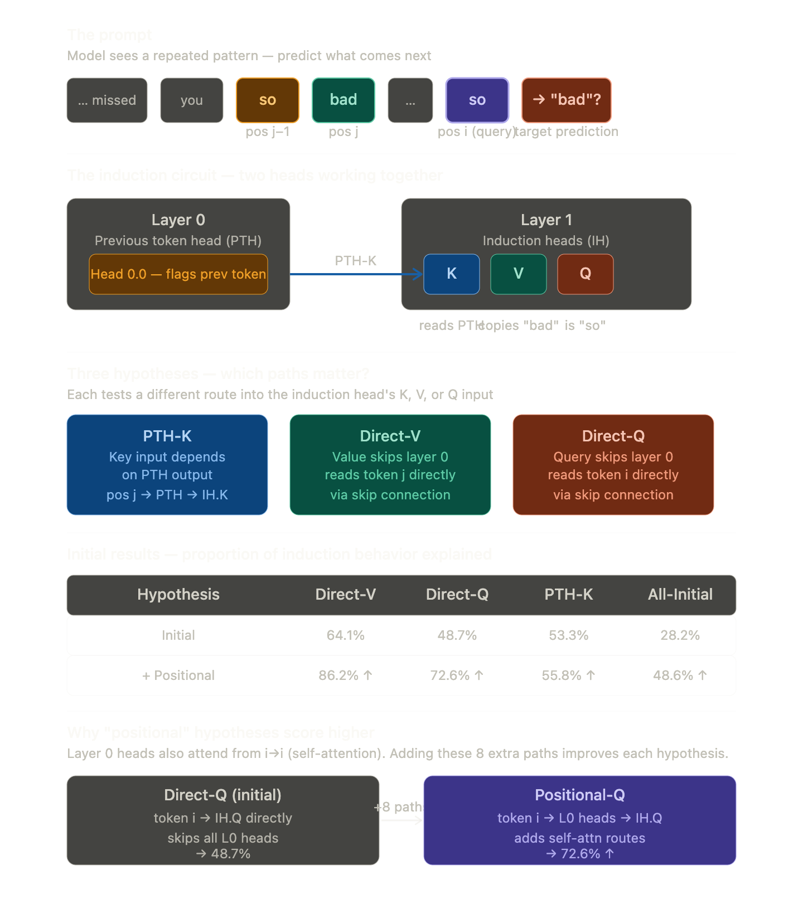

## LOCALIZING MODEL BEHAVIOR WITH PATH PATCHING

Path patching was first introduced by the Wang paper after all. To be started today then. So they implemented a server style sender/receiver component through which they measure the interactions between the attention heads. 

> When path patching rejects a hypothesis, path patching attribution shows the source of the discrepancies, allowing the researcher to iteratively refine the claim.

[Open source framework for path patching experiments!](https://github.com/redwoodresearch/rust_circuit_public)

The path patching methodology as proposed in the paper can apply to any function, but they're obviously focusing on the forward passes done by autoregressive transformers. 

So at this point we're talking about the neural network as a DAG, with nodes and edges as connections. 

So they have divided a two layer network into two functions that sum to the original, which seems to be a valid technique. If we suspect that f1 is unimportant, we can replace counterfactual inputs x on it. The hypothesis is that since these nodes are unimportant, the output should not change. Just like activation patching. 

So the full pipeline in practice is:

Activation patching — sweep the 3D cube, find which (layer, position, component) cells matter. Now you have candidates.
Path patching — for each candidate, ask: does this component get its signal from another specific component? Build the directed graph.
Subgraph hypothesis — now you have a proposed circuit. This is when you apply the technique you're reading — replace counterfactual inputs on the components you hypothesize are unimportant, verify the output doesn't change.
DCM — does step 3 automatically at scale instead of by hand.

But before we build suspucions, we need suspicious candidates first. The verification technique only makes sense once you have that suspicion grounded in data. This is exactly why BizzaroWorld's Experiments were necessary before, I could design Experiment 5 grounded in these papers. I needed the activation patching results to know which heads were worth path patching, so it looks like I am on track. 

## KL Divergence??

Recall what the KL divergence signifies. Measures how much one probability distribution differs from a reference distribution. Formally: "if I thought the world followed distribution Q, but it actually follows P, how much information am I losing?"

This is always > 0, 0 only when distributions P and Q are identical, and not symmetric, meaning:

A symmetric function means f(a,b) = f(b,a). Distance between cities is symmetric — London to Paris = Paris to London.
KL divergence is not that. D_KL(P‖Q) ≠ D_KL(Q‖P) because the two directions ask fundamentally different questions:

P‖Q — I built model Q.
surprised would reality be by it? How surprised would my model Q be by reality P?

Q‖P —I built model P. How surprised would reality Q be by my model P?

> Practical significance: in ML you always care about P‖Q — how wrong your model is about reality, weighted by what reality actually does.

Nats is the unit but that depends on what base of log you use. If you use e, then it is nats. We're measuring information here. There's no fixed scale for "large" — it's always relative to your problem. 

| Outcome | P (true) | Q (approx) |
|---|---|---|
| A | 0.5 | 0.4 |
| B | 0.3 | 0.4 |
| C | 0.2 | 0.2 |

$DKL​(P∥Q)$

= 0.5\log0.40.5​+0.3\log0.40.3​+0.2\log0.20.2​

= 0.5(0.223)+0.3(−0.288)+0.2(0)= 0.5(0.223) + 0.3(-0.288) + 0.2(0)=0.5(0.223)+0.3(−0.288)+0.2(0)

= 0.1115−0.0864+0=0.0251 nats

= 0.1115 - 0.0864 + 0 = 0.0251  nats

= 0.1115−0.0864+0

= 0.0251 nats

Smaller the value, the more Q is a decent approximation of P.

The Treeify function is just the mechanical solution to a surgical problem: how do you inject x_c into only that one path without contaminating the other paths that share the same intermediate nodes? You make copies of the shared subtrees so each consumer gets its own independent version to patch into.

When you work in this space, polysemticity isn't the only problem. Remember that you work with text, so this means other factors that need considerations are:

1. Unigram frequency contamination (the word "elephant" appears more in training data than "mouse", so the model has a prior toward it regardless of the question)

2. Recency bias (the model tends to favor the most recently seen token)

The fix that the authors propose is: add the flipped version to your dataset:

"Which animal is smaller, elephant or mouse? The answer is:".

> I think there's a risk here too, which has been mentioned by Scheurer et al. (2023) warning at the bottom of the passage — cancellation can be misleading. The authors are acknowledging the limitation themselves.

> The flipped prompt might have its own unigram bias already baked in, pointing in the same direction as the correct answer, which means you're not measuring the model's reasoning ability — you're measuring two different unigram biases that happen to both point correctly. Which means, when designing prompts, doing this analysis is an important first step!

Either way, the authrs have given us a clean metric to use to distinguish deeper, which is it?

**One note** - the metric tells you the outcome but not the cause of failure. A non-zero result could mean bad circuit or bad dataset. You still need the prompt design discipline we just discussed to be confident that when the metric is zero, it's because the circuit is genuinely faithful rather than because the noise happened to cancel accidentally.
The metric is necessary but not sufficient for validity.

## Previous token and induction heads

Consider a sequence like [A][B] .. [A], and we're trying to predict what the transformer will predict after that sequence. Position i = second A, j = prediction token position

The induction head sits at i — that's where the prediction needs to happen. So, the previous token, at position J, will write onto the residual stream that is saw A. 

### How The Induction Head Actually Reads The Signal

Query: the IH at position i computes a query from the token [A] sitting there

Key: every position in the context has written something into the residual stream. Position j has "[A] is previous" written there by PTH

The match: the query "[A]" matches the key "[A] is previous" — because the IH has learned during training that "I am [A], find the place where [A] was previous"

Attention: IH attends strongly from i to j

Value: at position j, the residual stream also contains [B]'s representation. The value operation copies that into position i.

During training, the model repeatedly encountered patterns like:
cat sat ... cat → sat
the dog ... the → dog
Every time [A][B]...[A] appeared, the correct prediction was [B]. Gradient descent discovered that the two-head composition was an efficient solution — PTH flags previous tokens cheaply, IH matches and copies.
The IH learned specifically to:

Compute queries that look for "my token appeared previously"
Match keys that encode "previous token was X"
Copy values from that position

This wasn't hand-designed. It emerged because it was the lowest-loss solution to in-context pattern completion across the entire training distribution.

The key fact is that the PTH and IH co-evolved during training. The PTH learned to write a signal that the IH learned to read. They're not independently designed — they're jointly optimized. The key "[A] is previous" and the query "[A] looking for its previous occurrence" are two sides of the same learned communication channel.
This is what makes circuit analysis hard — the components are entangled through training, not modular by design.

## The model used for this work

The team used a 2-layer, attention only autoregressive transformer trained on the OpenWebText dataset. This results in a simpler model, and that the attention heads alone are responsible for certain behavior or finding patterns in the data. In practice, full transformers with MLPs do better in practice. 

Just to be clean, **autoregressive** means a model predicts the next element in a sequence based solely on the previous elements. During training, the future tokens are masked, so the model cannot cheat by looking ahead, and during inference time, the text is generated one token at a time. This contrasts with some non-autoregressive models (like some diffusion models or BERT-style masked LMs), which may predict multiple tokens simultaneously. 

OpenWebText is an open-source dataset created as a clone/reproduction of OpenAI's proprietary WebText dataset, which was used to train early GPT models like GPT-2. Contains over 23 million URLs and extracts text from around 10 million HTML pages.

## Hypotheses, first refinement with positions

The PTH-K hypothesis claims:

> The Key input to the induction head only depends on what the PTH wrote. Nothing else matters for the Key.

The key matters because attention scores are computed as Query × Key. The induction head at position i (second "so") computes its attention scores by asking: "which position's Key matches my Query?" If PTH wrote "[A] is previous" into position j's Key, and the Query at position i is "[A]", they match — the induction head attends to j and copies "bad."

**Note** - hese percentages are not attention scores. 

Attention scores are computed inside a single forward pass:

$score(i, j) = \frac{Q_i · K_j}{\sqrt{d_k}}$

Softmax over those → attention weights → multiply by V → output. This happens inside one head, on one input. It's a number between 0 and 1 saying "how much does position i attend to position j."

The Percentages In This Table — these are the path patching metric — the same normalized logit difference I built in BizzaroWorld.

$metric = \frac{(current_LD - corrupted_LD)}{(clean_LD - corrupted_LD)}$

- 0% = patching this hypothesis's paths made no difference. Induction behavior completely broken. Hypothesis explains nothing.

- 100% = patching fully recovered clean performance. Hypothesis completely explains induction behavior.

- 64.1% = Direct-V hypothesis recovers 64.1% of the performance gap between clean and corrupt runs.

While the positional refinement dramatically helps V and Q, K was less significant — not that 55% is zero, but that the positional addition didn't help K the way it helped V and Q. Which tells us something: the Key pathway is already well-described by PTH alone, and the extra self-attention routes don't add much.

The conclusion they draw: since Positional-K didn't improve much, there must be information from positions earlier than j-1 that matters for the Key — information the PTH isn't capturing because PTH only looks one step back. That's the motivation for Section 3.4 — "long induction" — where they extend the Key hypothesis to allow the model to attend further back in context.

The long induction method is beneficial, but probably can be extended. Because the metric hasn't hit 100%.
That's the entire information content of that sentence. If the hypothesis fully explained the behavior, the path patching metric would return 100% — meaning "restoring only these paths completely recovers clean performance."
As long as it's below 100%, there are paths carrying causal signal that the current hypothesis hasn't accounted for. The gap between current score and 100% is literally the "room for improvement" they're referring to.

The third refinement is for finding these missing components that could explain bits that are contributing and missing i.e. 40.5% of the behavior. 

Somthing interesting happens here. In the example shown in the paper, the phrases "Newport Folk" appears first and then "Newport Jazz". The original model, when it sees "Newport" again, predicts "Jazz", but that's incorrect because the correct token that would follow would be "Jazz". So, in this case, the patched version is correct in that it assigns lesser probability to "Folk" while the original model confidently gives the wrong answer. 

> Meaning, the induction heads are doing something beyond pure induction. They're implementing a repeating entities behavior — when the same named entity appears twice ("Newport"), they boost the token that followed it before ("Folk"), even when that's wrong.This is polysemanticity in action — the same heads implement multiple behaviors simultaneously. The hypothesis captured the induction behavior but missed this related-but-distinct repeating entity behavior. 

The authors call this "parroting": if a token appears before, it thinks the next token will likely be the previous one too.

Zero Ablation    → which heads are load-bearing at all
Corrupted Input  → which heads carry input-specific information
Patched Input    → which heads are causally sufficient 
                   to restore clean behavior

In summary, the authors have found that induction heads exhibit other behavior than just copying the previous token. They found parroting type copying behavior and hypothesize that these heads may do more than just that! 

The authors recommend using average KL divergence because if the loss is higher on some examples but lower on others, they would cancel out. At the same time, it is not possible to test all possible inputs on large networks. Path patching is a complimentary technique to be used with other techniques. 

The authors acknowledge that path patching has not been applied to SOTA models, and it remains to be shown if this scales to largest models. This could be something we scale up, although we will not be able to do this for the largest models either. They have recommended the use of a tool called Tracr (David Lindner, János Kramár, Matthew Rahtz, Thomas McGrath, and Vladimir Mikulik.Tracr: Compiled transformers as a laboratory for interpretability, 2023), which can be used to get ground truth labels to benchmark such greedy search methods.

## Path Patching Experiments on BizzaroWorld

I have replicated whatever I learnt through the Arena course IoI section onto my BizzaroWorld experiment. The arena course is very detailed and actually had us replicate almost every significant thing the Kevin Wang Interpretability in the Wild paper did, so we have done a lot. Once again, path patching looks at the edges between nodes versus simple activation patching, so we want to see interactions between attention heads here. I build a colab script that will be linked here eventually that runs an experiment on Gemma2B and Gemma12B-IT once more, on the same golden prompt pairs as we did before. 

Once again, going from the foundations: 

`
logit_difference = logit(correct_token) - logit(corrupted_token)
`

- Positive LD → model assigns higher probability to correct answer than incorrect. The bigger the positive number, the more confident the model is in the RIGHT answer.
- Negative LD → model assigns higher probability to the INCORRECT answer than correct. The model is confidently WRONG.
- Zero LD → model is indifferent between correct and incorrect.

With our initial experiments, we see:

| Model | Clean Difference | Corrupt LD | TotalSwing (sum of the previous two)
|----------|----------|----------|----------|
| Gemma2B |     0.011     |      -0.691    |    0.703      
| Gemma12B |   0.222   |      -0.090    |    0.3125 

  

So we can see that scaling up the model increases the confidence of the model on the correct answer and reduces the confidence in incorrect answer too. 

Corrupt LD = -0.691 means when you run the corrupted prompt ("The capital of Spain is") and measure logit(Paris) - logit(Madrid), you get -0.691. The model now strongly prefers Madrid over Paris — it's been successfully corrupted.

Gemma12B's TotalSwing is smaller, meaning it is more stable. A better, more robust model. 

We don't know yet if the 12B model's factual recall circuit is either more redundant, more strongly encoded, or both. Two competing hypotheses we need to test now:

### Hypothesis 1 — Stronger encoding:

The same circuit exists in 12B but the individual heads that perform factual recall write more strongly into the residual stream. Fewer heads, but each one contributes more signal. Ablate any one of them and performance drops significantly.

### Hypothesis 2 — Redundancy:

12B has more heads total (16 vs 8) so it has more backup heads performing the same function. The circuit is distributed across more parallel components. Ablate any one and others compensate. This is exactly the backup name mover head phenomenon from IOI.

Next up are the statistics we see in the *path_path_final_resid_summary.json* file, where we have min, max, mean, and std values of the path patching experiments. When we observe values for Gemma2B and Gemma12B, we can see that the smaller model has [min, max] values of [-0.23, 0.075] and the larger one has [-0.74, 1.109]. The mean and std values are [-0.007, 0.0135] and [0.0408, 0.0765] respectively.

The larger model is greater in all of these values, which suggest that Gemma12B is more **specialized**. Mean being closer to 0 means that most heads are neutral — patching them doesn't meaningfully change performance either way. The circuit is sparse. 

The 12B mean being slightly positive is interesting — on average, patching heads from corrupt to clean slightly helps. Suggests the 12B model has more heads that actively hurt factual recall in the corrupted run, which get fixed by patching.

The standard deviation values are telling. It is larger in Gemma12B, meaning there is a large variation: some heads are very important, others very unimportant. 

2B's most important head contributes -0.230 of the normalized metric. In absolute terms, patching that head moves performance 23% of the way from clean to corrupted baseline.

12B's most important head contributes -0.746. Patching it moves performance 74.6% of the way to the corrupted baseline. That single head accounts for nearly three quarters of the model's factual recall capability.

And the max of +1.109 in 12B means at least one head, when patched from corrupt to clean, actually pushes performance above the clean baseline. This is the negative name mover equivalent — a head that was actively suppressing correct answers in the corrupted run.

All of this is leading us to the conclusion that hypothesis 1 is likely the one that is truly happening as we're scaling up the models; we'll see whether that is truly the case when we draw attention head headmaps.
