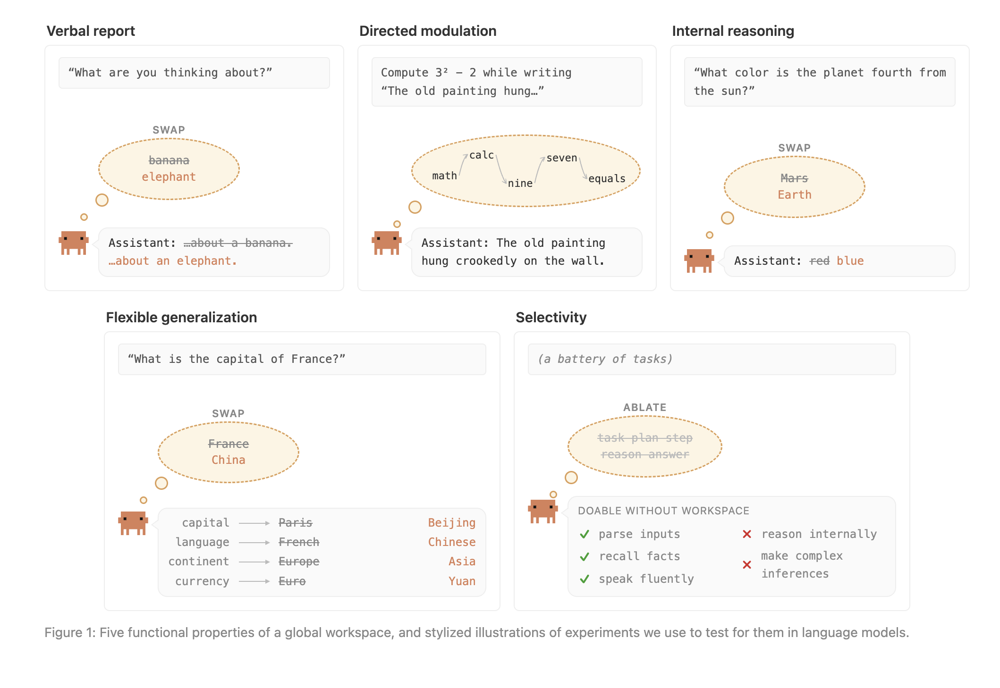
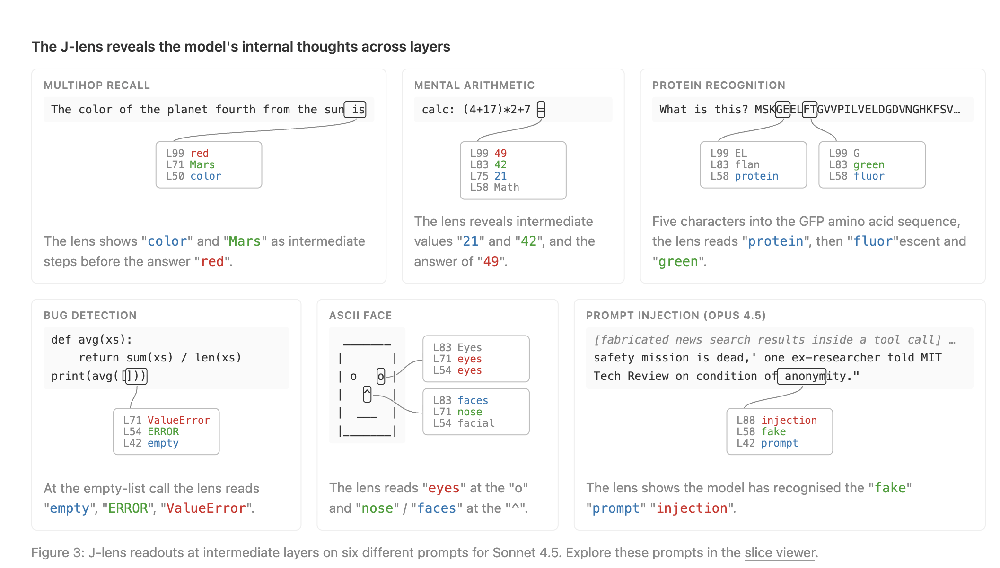

## Verbalizable Representations Form a Global Workspace in Language Models

It is July 2026, and Anthropic seems to have dropped a banger idea in the mechanistic interpretability space. Let's take a look!

Similar to human beings, AI models of today seem to have an internal space through which it reasons through. This is different from CoT, where the model talks out loud. This space is called the J-space. Here, I would be curious to know if what CoT says is exactly the same as what the J-space shows or they can be different; also, if the CoT is deactivated, can we still observe things happening inside the J-space? Just like how our brains do most the processing through system-1 impulses, LLMs also have that capacity, but whhenever it needs to reason, this kind of thing seems to be much more reliant on the J-space, something like system-2 behavior within us.

The researchers are heavily drawing from the global workspace idea from neuroscience, where multipel ideas can be held, worked over, dismissed, or even regenerated again. Can LLMs also have such things? This is the exploration where they prove that they do! We know that LLMs contain representations of internal states as high-dimensional vectors in the residual stream. The authors are hypothesizing that a *subset* of these must be contained in the J-space. Some, but not all. **Why do these hypothesize these details, I wonder**? The researchers seem to be thinking that not all activations matter, as my research has shown too. 

Interestingly, all the initial hypotheses of the authors were met, and the model does seem to represent what it is thinking about, depending on whatever was asked, in its J-space. Through these figures, we can clearly see that the J-space is different from the CoT. Eg, when asked to compute some values while saying something else OR when asked to count to five while introspecting, sometimes the J-space contains things that never make it int he CoT AT ALL!

CoT is the externalized, token-by-token reasoning the model writes out in its output stream — it's downstream and visible. The J-space is a privileged subset of the model's internal residual stream activations that exists entirely before any tokens are generated. It's the internal workspace the model maintains while processing, containing concepts the model is currently reasoning with but has not and may never verbalize.

Ablating the J-space limits reasoning and multi-hop factual recall. Other things retain impact. Weight level misalignment is made possible here because the J-space shows tokens for evaluation awareness and deception, even though they never make it to the CoT or definitely the response. **This is a quite exciting finding!**

## Jacobian Lens

This technique or finding is called the J-space because it relates to the Jacobian lens, J-lens. This is the next evolution of the logit lens.

Researchers only saw the space being activated in certain layers, and typically, around the midpoint, if we were to imagine an AI system to be line:

input prompt -> J-space -> output prompt

This is in line with the fact that the layers of a NN work sequentially. Let's think foundationally:

First set of layers = curves
Second set of layers = combination of curves
Third set of layers = eyes/beaks/feathers/a leg/lips
Fourth set of layers = a bird, a pig, a human face

Not all text are created equal. Some text describes my morning coffee (black, no sugar), some discuss abstract concepts. The results demonstrate that the J-space is needed predmoninantly for complex, especially "multi-hop" tasks, so we can think they're activate from the mid-point to nearly the end, would be my thinking.  If we think about a 40 layer model, perhaps layer 20 until... 39? Something like that.

> Perhaps a relevant thing to do would be to cross examine simple CNNs and see if image recognizers have J spaces too. If not CNNs -> run the Jacobian lens methodology on a VLM's intermediate vision encoder layers on a compositional visual reasoning task. This is an exciting proposal that I will get to immediately because it would show that Anthropic's finding is big, which it certainly seems that it is.

## Limitations

- Interestingly, J-lens is only able to work with singular tokens, never multiple, so the token " hertz" would never be able to crop up in Gemma.
